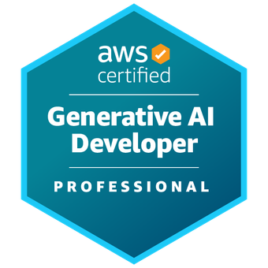
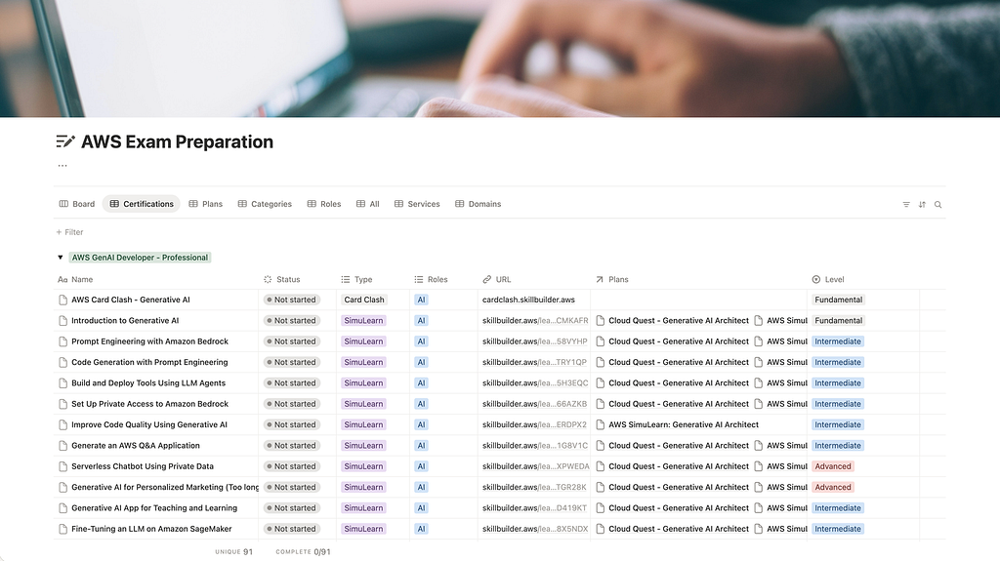
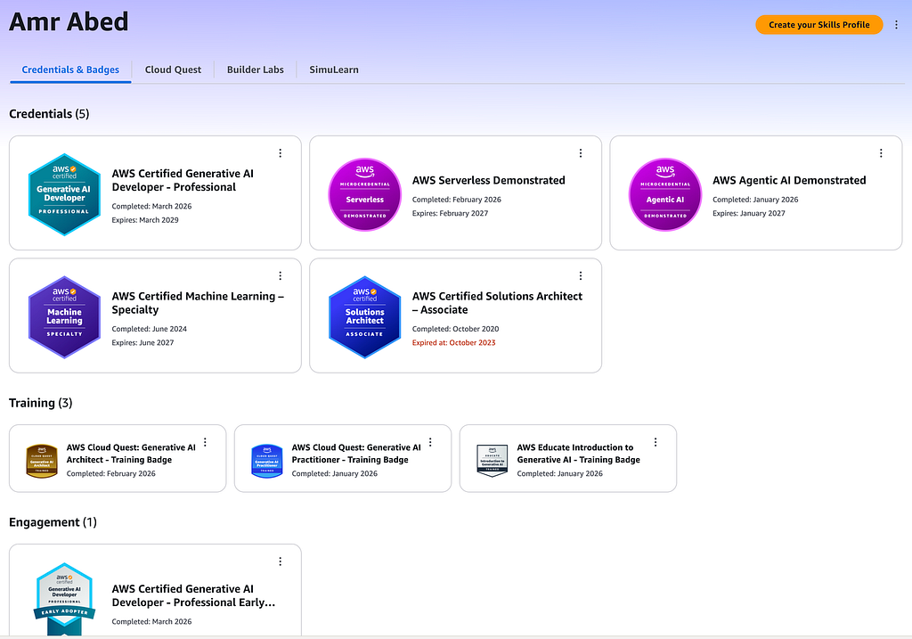
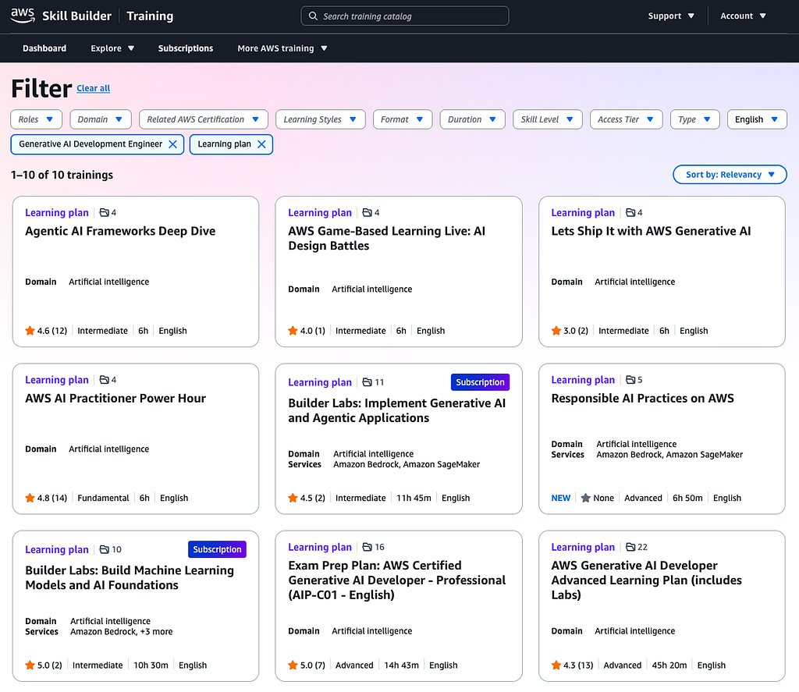

# The Only AIP-C01 Study Plan You Need

#### *How I Passed as One of the First 5,000 — And the Exact Plan I Used*

I recently passed the new AWS Certified Generative AI Developer Professional (AIP-C01) exam as an early adopter (one of the first 5,000 worldwide). Here’s the exact 6-week plan I used, so you don’t have to figure it out from scratch.

*AWS Certified AWS Generative AI Developer Professional Badge*

What you’ll find here is a complete, curated, sequenced study plan — the one I wish someone had handed me before I started. No fluff, just the resources that matter, in the order they matter.

**In this guide, you’ll find:**

* The Fast Track (if you’re short on time)
* Detailed Study Plan
* Notion Tracking Template
* Time-Saving Lab Strategies

### Do I really need to prepare?

*“I have been using AWS Generative AI for the last year or so. Do I really need to prepare?”*

Short answer: Yes!

No matter how long you have been working with AWS Generative AI tools, you may not be using all the tools covered by the exam in your day-to-day experience, or you may not have encountered all the scenarios seen on the exam. That’s proven true for any AWS certification exam, not only this one. If you have taken any AWS certification exam before, you already know that. In short, being *AWS-*ome at what you do daily and passing an AWS certification exam are two different skills, though highly interconnected.

That said, a minimum level of familiarity with the exam topic and at least some of the tools covered is required to pass. No amount of preparation can make up for that. Always make sure you are prepared before scheduling and taking the exam.

#### How long does it take?

Plan for 6–8 weeks at roughly 2–3 hours per day, depending on your existing Bedrock experience.

#### What to expect?

If you’re wondering how hard the AIP-C01 is, it felt harder than the AWS Machine Learning Specialty exam but more focused than the Solutions Architect exam. Expect Bedrock depth and several multi-service scenario questions. My practice scores plateaued at around 75% for the first couple of weeks, then eventually rose to around 95%. Don’t panic if progress feels slow mid-way. The domains click together in the final stretch.

### The Fast Track

If you are pressed for time:

* Focus on the [Bedrock User Guide](https://docs.aws.amazon.com/bedrock/latest/userguide) and the [Exam Prep Plan](https://skillbuilder.aws/learning-plan/9VXVGYT38G/exam-prep-plan-aws-certified-generative-ai-developer--professional-aipc01--english/4SCMN2659K)
* The [Generative AI for Developers](https://www.linkedin.com/events/generativeaifordevelopers-s1e1-7424609466043600896) videos are highly recommended for some exam tips and tricks
* You can just read only the topics that address any knowledge gaps you find in the [Advanced Learning Plan](https://skillbuilder.aws/learning-plan/BGTH16YCTU/aws-generative-ai-developer-advanced-learning-plan-includes-labs/ZDN46CX881)

### Notion Tracking Template

I have created a Notion database of study-plan items to track my preparation progress and group, sort, or filter by certification, plan, format, and domain. I am sharing it here so others can benefit as well. The database is available as a template at [amrabed.notion.site/aws-exam-prep](http://amrabed.notion.site/aws-exam-prep). Feel free to duplicate and use right away.

> *The database has content for other exams as well. Remember to filter by certification for AWS Certified Generative AI Developer — Professional*

*Notion database for AWS Exam Preparation*

### Preparation Material

The AWS Training & Certification team recommends these two learning plans for preparation:

* [Exam Prep Plan: AWS Certified Generative AI Developer — Professional](https://skillbuilder.aws/learning-plan/9VXVGYT38G/exam-prep-plan-aws-certified-generative-ai-developer--professional-aipc01--english/4SCMN2659K)
* [AWS Generative AI Developer Advanced Learning Plan](https://skillbuilder.aws/learning-plan/BGTH16YCTU/aws-generative-ai-developer-advanced-learning-plan-includes-labs/ZDN46CX881) *(as needed)*

I added a couple more learning plans for more hands-on practice:

* [Builder Labs: Implement Generative AI Applications on AWS](https://skillbuilder.aws/learning-plan/66NZQBVQD7/builder-labs-implement-generative-ai-and-agentic-applications/UYVE81N2Y7)
* [AWS SimuLearn: Generative AI Architect](https://skillbuilder.aws/learning-plan/CVTBV11V1K/aws-simulearn-generative-ai-architect/U39NTGR28K) or [AWS Cloud Quest: Generative AI Architect](https://skillbuilder.aws/learn/PFYH348EK2/aws-cloud-quest-generative-ai-architect/B3Q26P97G8)
* [AWS SimuLearn: Generative AI Practitioner](https://skillbuilder.aws/learning-plan/3HCD821CNZ/aws-simulearn-generative-ai-practitioner/BFKGA5VM8H) or [AWS Cloud Quest: Generative AI Practitioner](https://skillbuilder.aws/learn/5YB3FCEE1H/aws-cloud-quest-generative-ai-practitioner/26A81MG83V) (*Free*)

Both the AWS SimuLearn and the AWS Cloud Quest plans share the same labs. The list below points to the AWS SimuLearn labs, but you may want to do the Cloud Quest plan instead to earn a training badge.

Amazon Web Services (AWS) also produced a dedicated LinkedIn Live 4-episode series for the exam, [Generative AI for Developers](https://www.linkedin.com/events/generativeaifordevelopers-s1e1-7424609466043600896). I highly recommend watching them for some exam tips and tricks.

Last but definitely not least, the [Bedrock User Guide](https://docs.aws.amazon.com/bedrock/latest/userguide) is a must-read for this exam. I have highlighted the most relevant parts for each domain below.

> *Create an* [*AWS skills profile*](https://skillsprofile.skillbuilder.aws/) *if you don’t already have one. You will earn points and training badges during your preparation, and you want to showcase them.*

*AWS Skills Profile*

### Before you start

* Go over the [Exam Guide](https://docs.aws.amazon.com/aws-certification/latest/ai-professional-01/ai-professional-01.html) 🆓 to understand the exam structure
* Take the [Official Practice Question Set](https://skillbuilder.aws/learn/HSEKTD11NX/official-practice-question-set-aws-certified--generative-ai-developer--professional-aipc01--english/ZDANP82P4V) 🆓 to identify your knowledge gaps
* Go over the [Exam Prep Overview](https://skillbuilder.aws/learn/U91QQB8S2Q/exam-prep-overview-aws-certified-generative-ai-developer--professional-aipc01--english) 🆓

### The 6-Week Plan

* **Day 0**: Exam guide + Practice Questions
* **Day 1–13**: Domain 1 (31%)
* **Day 14–24**: Domain 2 (26%)
* **Day 25–31**: Domain 3 (20%)
* **Day 32–40**: Domains 4 & 5 (23%)
* **Day 41–42**: Final Review & Pretest

### My Comprehensive Study Plan

I have curated the list below covering the readings, labs, videos, and practice questions from the material above in a recommended *best-effort* sequence that aligns with the exam guide and provides the most comprehensive preparation.

Most of the items on the list require a subscription. The free items are marked 🆓. The subscription is currently $29 per month — totally worth it! And, you can always try to complete all the paid items on the list within one month 😉

> *Please feel free to copy the list and use it as a preparation checklist.*

#### Domain 1: FM Integration, Data Management, and Compliance

**Documentation** 🆓

* [Overview](https://docs.aws.amazon.com/bedrock/latest/userguide/what-is-bedrock.html)
* [Models](https://docs.aws.amazon.com/bedrock/latest/userguide/models.html)
* [Data Automation](https://docs.aws.amazon.com/bedrock/latest/userguide/bda.html)
* [Knowledge Bases](https://docs.aws.amazon.com/bedrock/latest/userguide/knowledge-base.html)
* [Prompt engineering concepts](https://docs.aws.amazon.com/bedrock/latest/userguide/prompt-engineering-guidelines.html)
* [Prompt management](https://docs.aws.amazon.com/bedrock/latest/userguide/prompt-management.html)
* [Model customization](https://docs.aws.amazon.com/bedrock/latest/userguide/custom-models.html)

**Hands-on Labs**

***Overview***

* Explore the Amazon Bedrock Playgrounds 🆓
* [Get Started with Generative AI](https://skillbuilder.aws/learn/ZCZVUZGPSS/aws-simulearn-get-started-with-generative-ai/T7TJ3K6WVZ) 🆓
* [Use AI Services with Amazon SageMaker](https://skillbuilder.aws/learn/2BDPR3RDK2/aws-simulearn-use-ai-services-with-amazon-sagemaker/FQCRQT43XZ) 🆓
* [Introduction to Generative AI](https://skillbuilder.aws/learn/UB55676Q4S/aws-simulearn-introduction-to-generative-ai/QS1YCMKAFR)
* [Generative AI for Personalized Marketing](https://skillbuilder.aws/learn/VENBUUH881/aws-simulearn-generative-ai-for-personalized-marketing/3NHRSJWH5S?parentId=U39NTGR28K)

***Foundation Models***

* [Exploring the Amazon Nova Micro Model for Text Generation](https://skillbuilder.aws/learn/9DKZV5768F/lab--exploring-the-amazon-nova-micro-model-for-text-generation/2WPQYJMYH3)
* [Exploring Amazon Nova Canvas Model and Amazon Nova Reel Model for Image and Video Generation and Editing](https://skillbuilder.aws/learn/E6PY767C2N/lab--exploring-amazon-nova-canvas-model-and-amazon-nova-reel-model-for-image-and-video-generation-and-editing/9YNXNBH3YE)
* [Exploring Amazon Nova Lite Model for Multimodal Understanding](https://skillbuilder.aws/learn/YHFYBR9YTB/lab--exploring-amazon-nova-lite-model-for-multimodal-understanding/8G34Y3R1TR)
* [Domain 1 Practice — Exploring Amazon Nova Models Using Amazon Bedrock Playgrounds](https://skillbuilder.aws/learn/NC3GDYFK1H/domain-1-practice-aws-simulearn--aws-certified-generative-ai-developer--professional-aipc01--english/261CTRTY13)

***Prompt Engineering***

* [Prompt Engineering with Amazon Bedrock](https://skillbuilder.aws/learn/FC13FQVQYG/aws-simulearn-prompt-engineering-with-amazon-bedrock/QDGW58VYHP)
* [Code Generation with Prompt Engineering](https://skillbuilder.aws/learn/Q86946Z2N6/aws-simulearn-code-generation-with-prompt-engineering/E9X7TRY1QP)

***Knowledge Bases***

* [Create an Enterprise Knowledge Assistant](https://skillbuilder.aws/learn/7E4FETUE2Y/aws-simulearn-create-an-enterprise-knowledge-assistant/2F4Q5XU8WB) 🆓
* [Enhance LLM Capabilities with a Vector Database](https://skillbuilder.aws/learn/82XQH1A396/aws-simulearn-enhance-llm-capabilities-with-a-vector-database/7354CYJWJR)
* [Modern Data Architectures with LLMs](https://skillbuilder.aws/learn/49C422WMXP/aws-simulearn-modern-data-architectures-with-llms/BXJVWVR5ZX)
* [Develop RAG Applications with Amazon Bedrock Knowledge Bases](https://skillbuilder.aws/learn/8EJFZ7R45W/lab--develop-retrieval-augmented-generation-rag-applications-with-amazon-bedrock-knowledge-bases/7B21X9MR8W)
* [Build and Evaluate RAG Applications using Knowledge Bases for Amazon Bedrock](https://skillbuilder.aws/learn/JRGWCFYT67/lab--build-and-evaluate-retrieval-augmented-generation-rag-applications-using-knowledge-bases-for-amazon-bedrock/A4MN58JB7A)
* [Intelligent Document Processing for the Financial Services Industry](https://skillbuilder.aws/learn/FWEY6R46Q3/lab--intelligent-document-processing-for-financial-services-industry/7USBXQZE5Q)
* [No-Code Insights Extraction Using Generative AI](https://skillbuilder.aws/learn/UHZTEZPYG6/aws-simulearn-nocode-insights-extraction-using-generative-ai/TTMWH3EU1C)

***Fine Tuning***

* [Fine-Tuning an LLM on Amazon SageMaker](https://skillbuilder.aws/learn/9V57WCXR4B/aws-simulearn-finetuning-an-llm-on-amazon-sagemaker/W3HW8X5NDX)
* [Automate Fine-Tuning of an LLM](https://skillbuilder.aws/learn/AJY3PDJ476/aws-simulearn-automate-finetuning-of-an-llm/EEZRBZXXW9)
* [Fine-Tune a Base Model with RLHF](https://skillbuilder.aws/learn/AT1JAP9Y95/aws-simulearn-finetune-a-base-model-with-rlhf/SZD4BQF742)

**Review and Questions**

* [Domain 1 Review](https://skillbuilder.aws/learn/GT2P1KK636/domain-1-review-aws-certified-generative-ai-developer--professional-aipc01-english/4GWFTZBZ74) 🆓
* [Domain 1 Questions](https://skillbuilder.aws/learn/V5N6SFRR6S/domain-1-practice-aws-certified-generative-ai-developer--professional-aipc01-english/NRSMYNRGY3)

**Video** 🆓

* [Generative AI For Developers | S1 E1 | Exam Overview and FM Integrations](https://www.linkedin.com/events/generativeaifordevelopers-s1e1-7424609466043600896/theater)

**Optional Reading**

* [Analyze Requirements and Design Generative AI Solutions](https://skillbuilder.aws/learn/9J5FH9NB4R/aws-generative-ai-developer--analyze-requirements-and-design-generative-ai-solutions/MWP57JVX51)
* [Select and Configure Foundation Models](https://skillbuilder.aws/learn/4X8CFYAMFR/aws-generative-ai-developer--select-and-configure-foundation-models/7FXZYRFQA6)
* [Implement data validation and processing pipelines](https://skillbuilder.aws/learn/697EZTMUJU/aws-generative-ai-developer--implement-data-validation-and-processing-pipelines/T58PCURDU8)
* [Design and Implement Vector Store Solutions](https://skillbuilder.aws/learn/XU57YH2BKJ/aws-generative-ai-developer--design-and-implement-vector-store-solutions/QHZVNUHSP4)
* [Design Retrieval Mechanisms for FM Augmentation](https://skillbuilder.aws/learn/BFXZR1G81B/aws-generative-ai-developer--design-retrieval-mechanisms-for-fm-augmentation/R64WEX5EJQ)
* [Implement Prompt Engineering Strategies and Governance](https://skillbuilder.aws/learn/AZ7ZCM788F/aws-generative-ai-developer--implement-prompt-engineering-strategies-and-governance/G4NTVS56ZT)

#### Domain 2: Implementation and Integration

**Documentation** 🆓

* [Agents: Automate tasks](https://docs.aws.amazon.com/bedrock/latest/userguide/agents.html)
* [Tool use](https://docs.aws.amazon.com/bedrock/latest/userguide/tool-use.html)
* [Inference: Generate responses](https://docs.aws.amazon.com/bedrock/latest/userguide/inference.html)
* [Amazon Bedrock Marketplace](https://docs.aws.amazon.com/bedrock/latest/userguide/amazon-bedrock-marketplace.html)
* [Flows](https://docs.aws.amazon.com/bedrock/latest/userguide/flows.html)
* [Session management](https://docs.aws.amazon.com/bedrock/latest/userguide/sessions.html)

**Hands-on Labs**

***Agentic AI***

* [Create an AI Smart Assistant](https://skillbuilder.aws/learn/PT6HBMUFM8/aws-simulearn-create-an-ai-smart-assistant/9VN4PQCUR8) [🆓](https://skillbuilder.aws/learn/YZDUMAQABG/aws-simulearn-explore-the-amazon-bedrock-playgrounds/88NAE39D3Z)
* [Build and Deploy Tools Using LLM Agents](https://skillbuilder.aws/learn/4ETUEUZRB1/aws-simulearn-build-and-deploy-tools-using-llm-agents/M7VV5H3EQC)
* [Explore Amazon Bedrock Agents integrated with Amazon Bedrock Knowledge Bases and Amazon Bedrock Guardrails](https://skillbuilder.aws/learn/EYJP8ZK9VK/lab--explore-amazon-bedrock-agents-integrated-with-amazon-bedrock-knowledge-bases-and-amazon-bedrock-guardrails/R3GGAEJHGG)
* [Financial Insights with Multimodal Agents](https://skillbuilder.aws/learn/BGXTVZ2DPE/aws-simulearn-financial-insights-with-multimodal-agents/PJJUWE8UXB)
* [Explore Generative AI Use Cases with LangChain and Amazon Bedrock](https://skillbuilder.aws/learn/ZUWYHSY7FZ/lab--explore-generative-ai-use-cases-with-langchain-and-amazon-bedrock/HADKRVY9AU)

***Model Deployment & Integration***

* [Harness the Power of LangChain](https://skillbuilder.aws/learn/67YQK61VA2/aws-simulearn-harness-the-power-of-langchain/7FRRY3YXUZ)
* [Intelligent Video and Audio Q&A with LLMs](https://skillbuilder.aws/learn/DABTKGUWNU/aws-simulearn-intelligent-video-and-audio-qa-with-llms/WJ5DNJUJPB)
* [Generate an AWS Q&A Application](https://skillbuilder.aws/learn/JVCXW4FCXN/aws-simulearn-generate-an-aws-qa-application/115N1G8V1C)
* [Serverless Chatbot Using Private Data](https://skillbuilder.aws/learn/X68QZAMTTR/aws-simulearn-serverless-chatbot-using-private-data/NVMAXPWEDA)
* [Generative AI App for Teaching and Learning](https://skillbuilder.aws/learn/BS5JKBDZJU/aws-simulearn-generative-ai-app-for-teaching-and-learning/QVX1D419KT)
* [Build Generative AI Apps with Foundation Models](https://skillbuilder.aws/learn/HEUG44UCYW/aws-simulearn-build-generative-ai-apps-with-foundation-models/J7X4P4FKME)
* [Develop Conversation Pattern with Amazon Bedrock APIs](https://skillbuilder.aws/learn/46TU77TNJG/lab--develop-conversation-pattern-with-amazon-bedrock-apis/6319ZBY9Z4)
* [Integrate Amazon Bedrock Foundation Models into a Serverless App](https://skillbuilder.aws/learn/QD6GGAVZXS/lab--integrate-amazon-bedrock-foundation-models-into-a-serverless-app/5XTGQEF5TV)
* [Create functions using AWS SDK for Python with Amazon Bedrock API](https://skillbuilder.aws/learn/EZYZ4XS4CS/lab--create-functions-using-aws-sdk-for-python-with-amazon-bedrock-api/AKJ7YYSGJN)
* [Build Production-Ready Generative AI Applications on AWS](https://skillbuilder.aws/learn/VECTFQJ18G/lab--build-productionready-generative-ai-applications-on-aws/B1B29VA81R?parentId=UYVE81N2Y7)
* [Domain 2 Practice — Document Processing with Amazon Bedrock](https://skillbuilder.aws/learn/G9DCFD6UCB/domain-2-practice-aws-simulearn--aws-certified-generative-ai-developer--professional-aipc01--english/9FJJU2CTMS)

***Development Tools***

* [Generate Code for a Webpage](https://skillbuilder.aws/learn/XR5XSR3BHZ/aws-simulearn-generate-code-for-a-webpage/SFXMVX8EFH) [🆓](https://skillbuilder.aws/learn/YZDUMAQABG/aws-simulearn-explore-the-amazon-bedrock-playgrounds/88NAE39D3Z)
* [Build and Understand Code with Amazon Q](https://skillbuilder.aws/learn/Y2FQ5WF2R2/aws-simulearn-build-and-understand-code-with-amazon-q/1C5TAE62YQ) [🆓](https://skillbuilder.aws/learn/YZDUMAQABG/aws-simulearn-explore-the-amazon-bedrock-playgrounds/88NAE39D3Z)
* [Improve Code Quality Using Generative AI](https://skillbuilder.aws/learn/W77W8SC1U6/aws-simulearn-improve-code-quality-using-generative-ai/71DWERDPX2)
* [Implement Security Fixes to Codebase using Amazon Q Developer](https://skillbuilder.aws/learn/CFU2FUX3C6/lab--implement-security-fixes-to-codebase-using-amazon-q-developer/B7RAF1BU6N)

**Review and Questions**

* [Domain 2 Review](https://skillbuilder.aws/learn/AK4C3YGY67/domain-2-review-aws-certified-generative-ai-developer--professional-aipc01--english/NJ1JV3UWM9) [🆓](https://skillbuilder.aws/learn/YZDUMAQABG/aws-simulearn-explore-the-amazon-bedrock-playgrounds/88NAE39D3Z)
* [Domain 2 Questions](https://skillbuilder.aws/learn/RVEJWM1KBZ/domain-2-practice-aws-certified-generative-ai-developer--professional-aipc01--english/SVE4Q3JSN3)

**Video** 🆓

* [Generative AI For Developers | S1 E2 | Implementation and Integration](https://www.linkedin.com/events/generativeaifordevelopers-s1e2-7427431654769594369/theater)

**Optional Reading**

* [Agentic AI Solutions and Tool Integrations](https://skillbuilder.aws/learn/EFHFQHUM7R/aws-generative-ai-developer--agentic-ai-solutions-and-tool-integrations/P7JC8RMXSU)
* [Model Deployment Strategies](https://skillbuilder.aws/learn/QE4JV2ZM2J/aws-generative-ai-developer--model-deployment-strategies/CEVRFXYVGN)
* [Enterprise Integration Architectures](https://skillbuilder.aws/learn/WJW5Y7GEGJ/aws-generative-ai-developer--enterprise-integration-architectures/GFT1NS9GE6)
* [Foundation Model API Integrations](https://skillbuilder.aws/learn/SWBETBZRSG/aws-generative-ai-developer--foundation-model-api-integrations/UCQPEKXKSS)
* [Implement Application Integration Patterns and Development Tools](https://skillbuilder.aws/learn/B1XJFH5DYA/aws-generative-ai-developer--implement-application-integration-patterns-and-development-tools/PDGRMSKNVD)

#### Domain 3: AI Safety, Security, and Governance

**Documentation** 🆓

* [Security](https://docs.aws.amazon.com/bedrock/latest/userguide/security-overview.html)
* [Bedrock Guardrails](https://docs.aws.amazon.com/bedrock/latest/userguide/guardrails.html)

**Hands-on Labs**

* [Secure Conversational AI with Guardrails](https://skillbuilder.aws/learn/6XKW5KV9FS/aws-simulearn-secure-conversational-ai-with-guardrails/R6NFKDHSND) 🆓
* [Set Up Private Access to Amazon Bedrock](https://skillbuilder.aws/learn/MFJEGXVW7B/aws-simulearn-set-up-private-access-to-amazon-bedrock/D3KX66AZKB)
* [Provision SageMaker in a Secure Environment](https://skillbuilder.aws/learn/D4UVDVA8GE/aws-simulearn-provision-sagemaker-in-a-secure-environment/M8XRRN2TPR?parentId=U39NTGR28K)
* [Building Secure and Responsible Generative AI with GuardRails](https://skillbuilder.aws/learn/DEFW74BV18/lab--building-secure-and-responsible-gen-ai-with-guardrails-for-amazon-bedrock/EWW6F5XMSH)
* [Moderate Generative AI Chat App Conversations](https://skillbuilder.aws/learn/V3VK57AYEK/aws-simulearn-moderate-generative-ai-chat-app-conversations/ECJXM14K7Z)
* [Moderator for Generative AI Content](https://skillbuilder.aws/learn/ZDUNTYGAC8/aws-simulearn-moderator-for-generative-ai-content/QYHZDNUZHK)
* [Bias Mitigation for a Translation Service](https://skillbuilder.aws/learn/7ZWAKHCJ39/aws-simulearn-bias-mitigation-for-a-translation-service/HGKPZPAY13)
* [Monitor a Model for Data Drift](https://skillbuilder.aws/learn/EB4JJXDGKZ/lab--monitor-a-model-for-data-drift/F8YT3RH3ZA)

**Review and Questions**

* [Domain 3 Review](https://skillbuilder.aws/learn/9UFTNQDJ8U/domain-3-review-aws-certified-generative-ai-developer--professional-aipc01--english/J43656ADK3) 🆓
* [Domain 3 Questions](https://skillbuilder.aws/learn/ASBN3JAAUG/domain-3-practice-aws-certified-generative-ai-developer--professional-aipc01--english/SUU236RXNR)

**Video** 🆓

* [Generative AI For Developers | S1 E3 | AI Safety, Security, and Governance](https://www.linkedin.com/events/generativeaifordevelopers-s1e3-7429961169710297088/theater)

**Optional Reading**

* [Safe User Interactions with Generative AI Applications](https://skillbuilder.aws/learn/9U6AYCC64R/aws-generative-ai-developer--safe-user-interactions-with-generative-ai-applications/RRCESSXBYG)
* [Implement Data Security and Privacy Controls](https://skillbuilder.aws/learn/SD43YU6AYA/aws-generative-ai-developer--implement-data-security-and-privacy-controls/EY9XC5AXFR)
* [Implement AI Governance, Compliance, and Transparency](https://skillbuilder.aws/learn/ESR9ZRK27V/aws-generative-ai-developer--implement-ai-governance-compliance-and-transparency/P93ZF42V9J)

#### Domain 4: Operational Efficiency and Optimization for AI Applications

**Documentation** 🆓

* [Capacity, Limits, and Cost Optimization](https://docs.aws.amazon.com/bedrock/latest/userguide/capacity-limits-cost-optimization.html)
* [Monitoring](https://docs.aws.amazon.com/bedrock/latest/userguide/monitoring.html)

**Review and Questions**

* [Domain 4 Review](https://skillbuilder.aws/learn/PEYR7XMDFQ/domain-4-review-aws-certified-generative-ai-developer--professional-aipc01--english/RKHB3VMJ23) [🆓](https://skillbuilder.aws/learn/YZDUMAQABG/aws-simulearn-explore-the-amazon-bedrock-playgrounds/88NAE39D3Z)
* [Domain 4 Questions](https://skillbuilder.aws/learn/E78PRJA6T4/domain-4-practice-aws-certified-generative-ai-developer--professional-aipc01--english/NSE8TTQEZ8)

**Video** 🆓

* [Generative AI For Developers | S1 E4 | Operations and Troubleshooting](https://www.linkedin.com/events/generativeaifordevelopers-s1e4-7432203857402916864/theater)

**Optional Reading**

* [Implementing Cost Optimization and Resource Efficiency Strategies](https://skillbuilder.aws/learn/C7DDZ8ETP4/aws-generative-ai-developer--implementing-cost-optimization-and-resource-efficiency-strategies/VD6YGCBDPG)
* [Optimize Application Performance](https://skillbuilder.aws/learn/C3CQ1ZJ212/aws-generative-ai-developer--optimize-application-performance/9KT2NT8H8U)
* [Implement Monitoring Systems](https://skillbuilder.aws/learn/YJZUP11TPR/aws-generative-ai-developer--implement-monitoring-systems/QHPEZJM69R)

#### Domain 5: Testing, Validation, and Troubleshooting

**Documentation** 🆓

* [Evaluate models](https://docs.aws.amazon.com/bedrock/latest/userguide/evaluation.html)

**Review and Questions**

* [Domain 5 Review](https://skillbuilder.aws/learn/UHY3CG2Q5T/domain-5-review-aws-certified-generative-ai-developer--professional-aipc01--english/Q6K7K67UEW) [🆓](https://skillbuilder.aws/learn/YZDUMAQABG/aws-simulearn-explore-the-amazon-bedrock-playgrounds/88NAE39D3Z)
* [Domain 5 Bonus Questions](https://skillbuilder.aws/learn/P3ENCEB2E7/domain-5-practice-aws-certified-generative-ai-developer--professional-aipc01--english/HNDP65ZV2F)

**Video** 🆓

* [*Episode 4*](https://www.linkedin.com/events/generativeaifordevelopers-s1e4-7432203857402916864/theater) *also covers domain 5 in the last 10 minutes*

**Optional Reading**

* [Implement Evaluation Systems for Generative AI](https://skillbuilder.aws/learn/AM9M42X85W/aws-generative-ai-developer--implement-evaluation-systems-for-generative-ai/YFBR1Z47E3)
* [Troubleshoot Generative AI Applications](https://skillbuilder.aws/learn/WB1ECBCME1/aws-generative-ai-developer--troubleshoot-generative-ai-applications/8CPC5ZV39G)

#### Final Review and Pretest

* Go over the [Exam Prep Summary](https://skillbuilder.aws/learn/F67DBSMZ9V/exam-prep-summary-aws-certified-generative-ai-developer--professional-aipc01--english/RFJWMN3DXQ) [🆓](https://skillbuilder.aws/learn/YZDUMAQABG/aws-simulearn-explore-the-amazon-bedrock-playgrounds/88NAE39D3Z)
* Retake: [Official Practice Question Set](https://skillbuilder.aws/learn/U91QQB8S2Q/exam-prep-overview-aws-certified-generative-ai-developer--professional-aipc01--english/SZ29259FX6) [🆓,](https://skillbuilder.aws/learn/YZDUMAQABG/aws-simulearn-explore-the-amazon-bedrock-playgrounds/88NAE39D3Z) [Domain 1 Questions,](https://skillbuilder.aws/learn/V5N6SFRR6S/domain-1-practice-aws-certified-generative-ai-developer--professional-aipc01-english/NRSMYNRGY3) [Domain 2 Questions,](https://skillbuilder.aws/learn/RVEJWM1KBZ/domain-2-practice-aws-certified-generative-ai-developer--professional-aipc01--english/SVE4Q3JSN3) [Domain 3 Questions,](https://skillbuilder.aws/learn/ASBN3JAAUG/domain-3-practice-aws-certified-generative-ai-developer--professional-aipc01--english/SUU236RXNR) [Domain 4 Questions,](https://skillbuilder.aws/learn/E78PRJA6T4/domain-4-practice-aws-certified-generative-ai-developer--professional-aipc01--english/NSE8TTQEZ8) [Domain 5 Questions](https://skillbuilder.aws/learn/P3ENCEB2E7/domain-5-practice-aws-certified-generative-ai-developer--professional-aipc01--english/HNDP65ZV2F)
* Take the [Official Pretest](https://skillbuilder.aws/learn/24FDAZ9UKG/official-pretest-aws-certified--generative-ai-developer--professional-aipc01--english/VFBSB1C83U)

#### Bonus

* Take the [AWS Agentic AI Demonstrated](https://skillbuilder.aws/learn/32Y249P272/aws-agentic-ai-demonstrated/TTAJ5WKYTS) microcredential
* Play the Generative AI track on [AWS Card Clash](https://cardclash.skillbuilder.aws/) just for fun!

#### Would you still like more?

If you need even more training, you can always search the AWS Skill Builder content with filters like:

* *Roles*: Generative AI Development Engineer
* *Format*: Learning plan

*AWS Skill Builder Gen AI Learning Plans*

### Time-Saving Tips

As you see in the study plan above, there is a lot to cover, ideally in no more than a month or two. So, you’ll need to save as much time as you can during your preparation. Here are a few tips and tricks based on my experience, especially if you decide to take the hands-on labs. You will notice that most of the lab time is consumed by provisioning the environment, deploying model endpoints, and running Jupyter notebooks. Here is how you can finish the labs faster.

#### No idle time

While the lab environment is being provisioned, don’t wait for provisioning to complete before starting. Go through the instructions for all three stages (Learn, Practice, and DIY) to hit the ground running once the environment is ready.

#### Parallelize tasks

Many DIY sections do not depend on the practice sections, which means you can complete both practice and DIY together. For instance, the practice section may ask you to start a 2-instance cluster, which the DIY asks to scale up to 3 instances. You can just go ahead and start a 3-instance cluster right away. Moreover, some steps are independent of one another, so open multiple tabs and continue to the next step while the current one completes.

#### Run all cells

For the Jupyter notebooks, skim through the notebook to understand the concepts, add any missing configuration or code, then run all cells rather than cell by cell.

#### Split screen

This is not technically a preparation tip, but it helps. Once the AWS sandbox environment is loaded, split the screen between the lab window with instructions and the AWS environment window to follow along more quickly.

### When to schedule the exam

I prefer to schedule the exam only when I can answer at least 90% of the questions correctly, with each question taking no more than 90 seconds on average. That gives me confidence that I can pass the exam smoothly, even under the added stress.

> *I only schedule the exam when I can hit 90%+ accuracy, spending no more than 90 seconds per question. That’s my personal go/no-go signal.*

### Further Reading

If you want to dig deeper into some of the topics covered in the exam, here are a few AWS resources:

* [Amazon Bedrock User Guide](https://docs.aws.amazon.com/bedrock/latest/userguide/index.html) (*A must-read for this exam*)
* [AgentCore Developer Guide](https://docs.aws.amazon.com/bedrock-agentcore/latest/devguide/index.html)
* [AWS Well-Architected Framework](https://docs.aws.amazon.com/wellarchitected/latest/framework/welcome.html)
* [AWS Step Functions Developer Guide](https://docs.aws.amazon.com/step-functions/latest/dg/welcome.html)
* [Amazon SageMaker AI Developer Guide](https://docs.aws.amazon.com/sagemaker/latest/dg)
* [Amazon OpenSearch Developer Guide](https://docs.aws.amazon.com/opensearch-service/latest/developerguide/index.html)

> *A big thank-you to the AWS Training & Certification team for the incredibly well-structured content on AWS Skill Builder. The domain-by-domain video series, the hands-on labs, and the Official Practice Questions were the backbone of my preparation. This article is essentially a curated map of their work.*

*I passed this exam before most study guides existed. If this plan helped you pass or saved you time, let me know in a comment. I’d love to hear what worked best for you, and what you’d add. If you find it useful, share it with the next engineer searching for where to start and give it a clap 👏 (or 50 😉) — it helps other engineers find it.*
