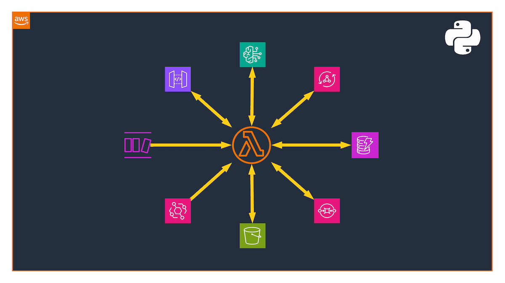

# Stop Writing Lambda Boilerplate

<!-- **Accelerate your serverless development with production-grade Python templates for AWS Lambda, pre-wired with best practices and modern tooling.** -->


Introducing the [**cur8d/lambda**](https://github.com/cur8d/lambda) open-source repository — a collection of production-ready Python Lambda templates for Bedrock Agent, REST API, GraphQL, DynamoDB Stream, EventBridge, S3, and SQS scenarios. These templates come pre-integrated with **AWS Lambda Powertools**, **AWS CDK**, **Pydantic**, and a robust testing infrastructure.

---




Every serverless developer knows the feeling. You spin up a new Lambda project, and before writing a single line of business logic, you're already copying boilerplate from a previous project: setting up AWS Lambda Powertools, wiring up structured logging, configuring X-Ray tracing, and building yet another Repository class for DynamoDB access.

This repetitive setup isn't just tedious — it's a source of inconsistency across projects and a hidden risk. Teams often skip best practices under time pressure, and the "quick Lambda" becomes the undocumented, untested function that nobody dares touch six months later.

That's why I built [**cur8d/lambda**](https://github.com/cur8d/lambda) — a collection of production-ready, plug-and-play Python Lambda templates for some of the common real-world scenarios on AWS.

## The Problem with Lambda Bootstrapping

AWS Lambda's promise is simplicity: deploy a function, it scales. But production Lambda functions require significantly more than a handler file. You need:

- **Structured logging** that integrates with CloudWatch Insights
- **Distributed tracing** with AWS X-Ray
- **Metrics** for operational visibility
- **Batch processing** for event sources like SQS and DynamoDB Streams
- **Strong typing** to catch bugs at development time, not runtime
- **Infrastructure as Code,** so your function is reproducible and auditable
- **Comprehensive tests** with AWS service mocking

Most developers piece this together manually each time — or worse, they copy a "good enough" version from a previous project and gradually accumulate inconsistencies.

## Introducing cur8d/lambda

[cur8d/lambda](https://github.com/cur8d/lambda) is a GitHub template repository that gives you a complete, opinionated, production-grade starting point for Python Lambda development. It currently covers seven real-world scenarios out of the box:

- **Bedrock Agent** — Handle function-based actions from Amazon Bedrock Agents
- **GraphQL API** — Resolve AppSync GraphQL requests
- **REST API** — Handle API Gateway REST requests
- **DynamoDB Stream** — Batch-process stream events with failure handling
- **EventBridge** — React to events and call external APIs
- **S3 to SQS** — Queue messages on S3 object changes
- **SQS to DynamoDB** — Batch-process SQS messages into DynamoDB

Each template is a fully self-contained starting point. Pick your scenario, rename the project, and start writing business logic immediately.

## What’s Pre-Wired for You

### AWS Lambda Powertools

Every template integrates [AWS Lambda Powertools for Python](https://docs.aws.amazon.com/powertools/python) — AWS's first-party library for Lambda best practices. This gives you:

- **Structured JSON logging** with correlation IDs automatically injected
- **CloudWatch EMF Metrics** for operational dashboards without custom code
- **AWS X-Ray Tracing** with automatic subsegment creation
- **Batch processing** utilities for SQS and DynamoDB Streams, including partial failure handling
- **Parameter and Secrets loading** with caching built in
- **Event source data classes** for type-safe event parsing

You don't configure any of this — it's already there. More on that later.

### Pydantic Data Modeling

All input/output models are defined using [Pydantic](https://docs.pydantic.dev/), giving you automatic validation, serialization, and type safety.

```python
from uuid import uuid4

from pydantic import BaseModel, Field
from pydantic.alias_generators import to_camel


class Item(BaseModel, alias_generator=to_camel, populate_by_name=True):
    id: str = Field(
        description="Unique item identifier", default_factory=lambda: str(uuid4())
    )
    name: str = Field(description="Human-readable item name")
```

The `alias_generator=to_camel` configuration means the JSON payload from API Gateway uses `camelCase` while the Python code uses `snake_case` — matching JSON conventions on the wire and Python conventions in code, with zero manual mapping.

### Infrastructure as Code with AWS CDK

Every template ships with a matching [AWS CDK](https://aws.amazon.com/cdk) stack under `infra/stacks/`. Deploy any stack with a single command:

```bash
make deploy STACK=api
```

No manual console clicks. No documentation to update. The infrastructure is the code.

### Clean Architecture with the Repository Pattern

All database access is encapsulated in a `Repository` class, separating your business logic from AWS service calls. This makes testing trivial and keeps your handler functions focused on what matters: the business logic.

### Testing That Actually Tests Things

The test suite uses:

- [**pytest**](https://pytest.org/) for test orchestration
- [**moto**](http://docs.getmoto.org/) for AWS service mocking (DynamoDB, SQS, S3 — all mocked locally)
- [**Hypothesis**](https://hypothesis.readthedocs.io/) for property-based testing, automatically generating edge-case inputs
- [**coverage**](https://coverage.readthedocs.io/) for coverage reporting

Run the entire suite with:

```bash
make test
```

### Code Quality, Automated

- [**ruff**](https://docs.astral.sh/ruff) for linting and formatting (replacing Flake8, isort, Black)
- [**pyright**](https://microsoft.github.io/pyright) for static type checking
- [**pre-commit**](https://pre-commit.com/) hooks to enforce quality before every commit
- [**Dependabot**](https://docs.github.com/en/code-security/dependabot) for automated dependency updates

### Developer Experience

- [**Dev Containers**](https://code.visualstudio.com/docs/devcontainers/containers) support means you can open the repo in VS Code and have the entire development environment running in Docker — Python, Poetry, CDK, and all tools pre-installed—no setup required.

- [**MkDocs**](https://www.mkdocs.org/) for auto-generated API documentation published to GitHub Pages

- [**GitHub Actions**](https://github.com/features/actions) workflows for CI/CD and documentation deployment
- **AI Agent guidelines** (`AGENTS.md`) providing context for AI coding assistants working in the repo

## AWS Lambda Powertools — In Practice

Every template integrates [**AWS Lambda Powertools for Python**](https://docs.aws.amazon.com/powertools/python) as a first-class citizen — not as an afterthought bolted on after the fact. Here's how it actually shapes each template.

### Batch Processing with Partial Failure Handling

This is where Powertools saves the most code — and prevents the most production incidents.

Without Powertools, batch processing from SQS or streams requires you to manually track which records succeeded and which failed, then construct a `batchItemFailures` response telling Lambda which messages to retry. Get it wrong and you either re-process successfully handled messages (causing duplicates) or silently drop failed ones.

The **SQS** template uses `BatchProcessor` to handle this automatically:

```python
from aws_lambda_powertools.utilities.batch import (
    BatchProcessor,
    EventType,
    process_partial_response,
)
from aws_lambda_powertools.utilities.batch.types import PartialItemFailureResponse

processor = BatchProcessor(event_type=EventType.SQS)


def handle_record(record) -> None:
    try:
        ...
    except Exception as exc:
        logger.error("Failed to process record", exc_info=exc)
        raise  # Re-raise so BatchProcessor marks it as a failed item


def main(event, context) -> PartialItemFailureResponse:
    return process_partial_response(
        event=event,
        record_handler=handle_record,
        processor=processor,
        context=context,
    )
```

If `handle_record` raises for one message, `BatchProcessor` catches it, logs the failure, continues processing the rest of the batch, and returns the correct `batchItemFailures` response. Your DLQ only receives the genuinely failed messages — not the whole batch.

The same pattern applies to **DynamoDB Streams**, where handling partial failures is equally critical to prevent stream stalls:

```python
from aws_lambda_powertools.utilities.batch import (
    BatchProcessor,
    EventType,
    process_partial_response,
)

processor = BatchProcessor(event_type=EventType.DynamoDBStreams)


def handle_record(record):
    try:
        ...
    except Exception as exc:
        logger.error("Failed to process record", exc_info=exc)
        raise  # Re-raise so BatchProcessor marks it as a failed item


def main(event, context):
    return process_partial_response(
        event=event,
        record_handler=handle_record,
        processor=processor,
        context=context,
    )
```

### Event Parsing and Handling

Lambda Powertools really shines here. Whether it’s handling a Bedrock Agent tool use, REST API request, or a GraphQL query, Powertools provides resolvers that eliminate custom event parsing.

The **Bedrock Agent** template uses the `BedrockAgentFunctionResolver` and the `@app.tool` decorator:

```python
from aws_lambda_powertools.event_handler import BedrockAgentFunctionResolver
from aws_lambda_powertools.utilities.data_classes import BedrockAgentEvent

app = BedrockAgentFunctionResolver()


@app.tool(name="getItem", description="Gets item details by ID")
def get_item(item_id: str) -> dict: ...


@app.tool(
    name="createItem",
    description="Creates a new item with name and optional description",
)
def create_item(item_id: str, name: str, description: str | None = None) -> dict: ...


def main(event: BedrockAgentEvent, context: LambdaContext) -> dict:
    """Lambda entry point for the Bedrock Agent handler"""
    return app.resolve(event, context)
```

The **REST API** template uses the `APIGatewayRestResolver` and Flask-like decorators — meaning if you've used Flask or FastAPI, you'll feel right at home:

```python
from aws_lambda_powertools.event_handler import APIGatewayRestResolver
from aws_lambda_powertools.event_handler.api_gateway import Response

app = APIGatewayRestResolver()


@app.get("/items/<id>")
def get_item(id: str) -> Response:
    """Retrieve an item by ID"""
    ...

    return Response(status_code=200, content_type="application/json", body=dumps(item))


@app.post("/items")
def create_item() -> Response:
    """Create a new item from the request body"""
    body = app.current_event.json_body
    ...
    return Response(status_code=201, content_type="application/json", body=dumps(item))


def main(event: dict, context: LambdaContext) -> dict:
    """Lambda entry point for the API Gateway handler"""
    return app.resolve(event, context)
```

The **EventBridge** template uses the `event_parser` to ensure your events match your Pydantic models before your logic even runs:

```python
from aws_lambda_powertools.utilities.parser import event_parser
from aws_lambda_powertools.utilities.parser.models import EventBridgeModel


@event_parser(model=EventBridgeModel)
def main(event: EventBridgeModel, context) -> None:
    handle(event)
```

### Combining Powertools with Pydantic

One of the most useful patterns across the templates is combining Powertools event data classes with Pydantic models for end-to-end type safety.

Powertools parses the raw Lambda event into a typed object (so you're not indexing into raw dicts). Pydantic then validates and deserializes the *business payload* within that event:

```python
from aws_lambda_powertools.event_handler import APIGatewayRestResolver
from pydantic import ValidationError

app = APIGatewayRestResolver()


@app.post("/items")
def create_item() -> Response:
    # Powertools resolves the typed API Gateway envelope
    body = app.current_event.json_body
    # Pydantic validates the business payload
    try:
        item = Item.model_validate(body)
    except ValidationError as exc:
        return Response(
            status_code=422,
            content_type="application/json",
            body=dumps({"error": "..."}),
        )
    ...
    return Response(
        status_code=201, content_type="application/json", body=dumps(item.dump())
    )
```

In the **Bedrock Agent** template, the same pattern applies via `BedrockAgentFunctionResolver` — Powertools resolves the agent event, and typed function signatures replace manual parameter extraction:

```python
# templates/agent/handler.py
from aws_lambda_powertools.event_handler import BedrockAgentFunctionResolver
from aws_lambda_powertools.utilities.data_classes import BedrockAgentEvent
from aws_lambda_powertools.utilities.typing import LambdaContext

from templates.agent.models import Item

repository = Repository(settings.table_name)
app = BedrockAgentFunctionResolver()


@app.tool(name="getItem", description="Gets item details by ID")
def get_item(item_id: str) -> dict:
    item = repository.get_item(item_id)
    if not item:
        return {"error": f"Item {item_id} not found"}
    return item


@app.tool(
    name="createItem",
    description="Creates a new item with name and optional description",
)
def create_item(item_id: str, name: str, description: str | None = None) -> dict:
    item = Item(id=item_id, name=name, description=description)
    repository.put_item(item.model_dump())
    return item.model_dump(by_alias=True, exclude_none=True)


def main(event: BedrockAgentEvent, context: LambdaContext) -> dict:
    """Lambda entry point for the Bedrock Agent handler"""
    return app.resolve(event, context)
```


### Fetching Parameters and Secrets

In the **EventBridge** template, the handler calls an external API using an API token stored in the **Secrets Manager**. With Lambda Powertools, that adds exactly three lines of code:

```python
from aws_lambda_powertools.utilities.parameters import SecretsProvider

secret_provider = SecretsProvider()

token = secret_provider.get(secret_name)
```

The same goes for loading configuration from the **Parameter Store** (`SSMProvider`), **AppConfig** (`AppConfigProvider`), or a **DynamoDB** table (`DynamoDBProvider`):

```python
from aws_lambda_powertools.utilities.parameters import SSMProvider

provider = SSMProvider()

configuration = provider.get(key)
```

### Structured Logging That Travels With Your Request

The logger is initialized once at module level and injected into every handler via the `@logger.inject_lambda_context` decorator. This automatically appends the Lambda context (function name, version, cold start flag, and AWS request ID) to every log line — without you writing a single line of configuration code.

```python
from aws_lambda_powertools import Logger

logger = Logger(service="api")


@logger.inject_lambda_context(log_event=True)
def handler(event: APIGatewayProxyEventV2, context: LambdaContext) -> dict:
    logger.info("Processing request", path=event.path, method=event.http_method)
    ...
```

The output in CloudWatch is structured JSON from the first line:

```json
{
  "level": "INFO",
  "message": "Processing request",
  "path": "/users",
  "method": "GET",
  "service": "api",
  "function_name": "my-api-handler",
  "cold_start": true,
  "aws_request_id": "abc-123"
}
```

**This matters at scale**: CloudWatch Logs Insights can now query your logs by any of these fields. Finding all cold starts, or all errors on a specific path, becomes a one-line query instead of a regex hunt through raw strings.

### Tracing Without Instrumentation Noise

X-Ray tracing is applied via two decorators that require no additional configuration:

```python
from aws_lambda_powertools import Tracer

tracer = Tracer(service=settings.service_name)


# On methods — creates child subsegments in X-Ray
@tracer.capture_method
def handle_record(record: SQSRecord) -> None:
    repository.put_item(process(record.body))


# On the Lambda handler — creates the root X-Ray segment
@tracer.capture_lambda_handler
def main(event: dict, context: LambdaContext) -> dict: ...
```

The `@tracer.capture_lambda_handler` decorator creates the root X-Ray segment, and `@tracer.capture_method` on Repository methods creates child subsegments — so your X-Ray service map shows handler → repository → DynamoDB as distinct, timed segments. You can see exactly where latency lives without writing a single `xray_recorder.begin_subsegment()` call.

### CloudWatch Metrics Without Custom Namespaces

Most Lambda functions either skip custom metrics entirely — relying on the default Lambda service metrics — or end up with a tangled mix of `boto3` CloudWatch `put_metric_data` calls scattered across the codebase. Neither approach is great in production.Powertools solves this with the `Metrics` utility, which uses [**CloudWatch Embedded Metric Format (EMF)**](https://docs.aws.amazon.com/AmazonCloudWatch/latest/monitoring/CloudWatch_Embedded_Metric_Format.html) to emit custom metrics as structured log lines. No `boto3` calls, no extra latency, no IAM permissions beyond what CloudWatch Logs already has.

Each template initializes a `Metrics` instance at module level with a shared namespace and service name:

```python
from aws_lambda_powertools import Metrics
from aws_lambda_powertools.metrics import MetricUnit

metrics = Metrics(namespace=settings.metrics_namespace, service=settings.service_name)


def process(event, context):
    ...
    metrics.add_metric(name="Processed", unit=MetricUnit.Count, value=1)


@metrics.log_metrics
def main(event: dict, context: LambdaContext) -> dict:
    return process(event, context)
```

The `@metrics.log_metrics` decorator flushes all buffered metrics at the end of each invocation as a single EMF-formatted log line — CloudWatch automatically parses it and makes those metrics available in dashboards and alarms without any additional infrastructure.

**`capture_cold_start_metric=True`** is a one-liner that adds a `ColdStart` metric to every function automatically. In production, tracking cold starts per function gives you a clear signal for when to invest in provisioned concurrency — no custom instrumentation needed.


## Getting Started in Under 5 Minutes

**1. Create your repository**

Click [Use this template](https://github.com/amrabed/aws-lambda-templates/generate) on GitHub to create a new repository from the template.

**2. Rename the project**

After cloning, run the setup command once:

```bash
make project NAME="new-name" DESCRIPTION="New description" AUTHOR="Your Name" EMAIL="you@example.com" GITHUB="yourusername"
```

This renames all references throughout the codebase in a single step.

**3. Install and run**

```bash
make install      # Install dependencies via Poetry
make precommit    # Install pre-commit hooks
make test         # Run tests with coverage
```

**4. Deploy**

That's it. You're shipping production-grade Lambda code, not maintaining boilerplate.

```bash
make deploy STACK=api    # Deploy the REST API scenario
```

## Design Decisions Worth Noting

- **Python 3.14+**: The templates target the latest Python runtime. Lambda supports Python 3.14, and you should be using it.
- **Poetry over pip/requirements.txt**: Deterministic dependency resolution and lock files eliminate the "works on my machine" problem. `pyproject.toml` is the single source of truth for the entire project configuration.
- **Makefile as the interface**: All common operations — install, test, lint, deploy, docs — are exposed through `make` commands. This creates a consistent interface regardless of the underlying tools, making CI/CD pipeline configuration trivial.
- **camelCase for JSON, snake_case for Python**: AWS services speak camelCase; Python speaks snake_case. Pydantic's `alias_generator=to_camel` bridges the gap automatically, keeping both sides idiomatic.

## The Bedrock Agent Template

One template deserves special mention: the **Bedrock Agent** template. As generative AI workloads move to production on AWS, Lambda functions increasingly serve as the action executors behind Amazon Bedrock Agents. This template gives you a proper starting point for building agent action groups — with typed request/response models, error handling, and the exact response schema Bedrock expects.

It's production-ready for the AI-native workloads being built today.

## Contributing

The repository is open source under the MIT license. Contributions are welcome — whether that's a new template scenario, improved infrastructure code, additional test coverage, or documentation improvements. Check out the [contributing guidelines](https://github.com/amrabed/aws-lambda-templates/blob/main/docs/CONTRIBUTING.md) to get started.

---

If you're building on AWS Lambda and you find yourself writing the same setup for the third time, I hope `cur8d/lambda` saves you that time and helps you ship better, more consistent serverless code.


**Ready to start?** Head over to the repository and click **"Use this template"**:

👉 [**github.com/cur8d/lambda**](https://github.com/cur8d/lambda)
