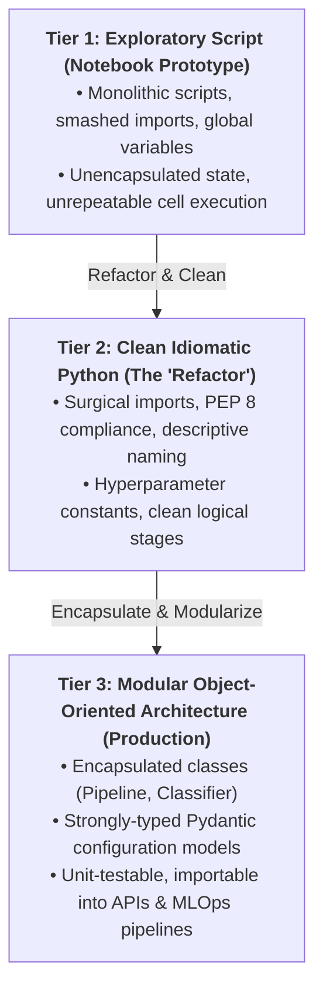
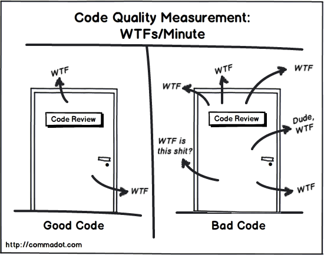
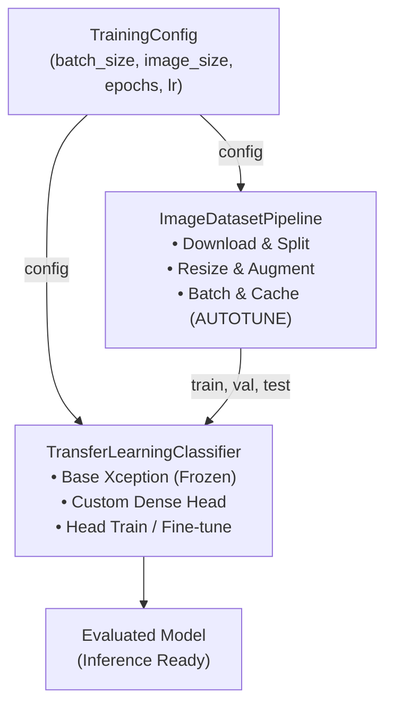

**An Engineer’s Take on Data Science Code**

---


*Photo by [Chris Ried](https://unsplash.com/@cdr6934?utm_source=medium&utm_medium=referral) on [Unsplash](https://unsplash.com?utm_source=medium&utm_medium=referral)*

As the Machine Learning Engineering Manager at an AI-powered SaaS company, I get a front-row seat to the machine learning (ML) code written across data science teams. When I’m not reviewing models and production pipelines, I dabble in the occasional Kaggle competition — though I'll be the first to admit I'm more of an enthusiastic competitor than a podium regular.

A recurring pattern quickly emerges: many brilliant data scientists come from mathematics, statistics, or academic research where code is treated merely as a vehicle to run an experiment. Python was adopted as a friendlier upgrade from R or MATLAB. The resulting code may hit top leaderboard accuracy, but in terms of software craftsmanship, it's often about as elegant as a spork.

"Working" code is no longer enough when models move from quick experiments to production pipelines.

---

## Why Should You Care About Clean ML Code?

> *"Clean code always looks like it was written by someone who cares."*  
> — **Michael Feathers**, quoted in Robert C. Martin's [*Clean Code*](https://www.goodreads.com/work/quotes/3779106)

When you write machine learning code, you're communicating with an audience: your future self six months from now, your teammates, and the engineers responsible for running your model in production.

My software journey began in 2003 as a Computer Engineering student at one of Egypt's top universities. Starting with C++ (rather than C) naturally trained me in object-oriented programming (OOP), separation of concerns, and clean architectural design.

Fast-forward to graduate school at Virginia Tech (2014–2017): I dove into machine learning and deep learning, tinkering with Pandas and early versions of TensorFlow (yes, versions 0.12 and 1.0 — Google, I’ll take that apology now).

Coming from that engineering background, I’ve always had a soft spot for clean code. For me, writing clean code is like signing a piece of art. That includes machine learning code. At one point, I even took a stab at [rewriting DL4J](https://github.com/amrabed/DL4J) (Deep Learning for Java) with a modern object-oriented architecture.

In modern MLOps environments, orchestrating workloads on platforms like **MLflow**, **TFX**, **Kubeflow**, and **AWS SageMaker**, sloppy code isn't just an eyesore; it's a real operational risk. Silent bugs, unreproducible splits, untracked dependencies, and unreadable transformations slow down teams and break downstream services.

---

## The 3-Tier ML Code Maturity Model

To turn this philosophy into an actionable engineering workflow, I think of ML code quality as progressing through three distinct maturity tiers:



Let's walk through the foundational rules that take you from Tier 1 to Tier 2, and then explore how object-oriented design elevates your code to Tier 3.

---

## 5 Foundational Rules for Clean ML Code

### 1. Learn Your Tools (Stop Reinventing Vectorized Operations)

Libraries like NumPy, Pandas, PyTorch, and TensorFlow provide highly optimized C and CUDA backends. Take the time to study the API references before resorting to Python `for` loops across lists.

I once reviewed a pipeline where a data scientist had written a 40-line nested loop to normalize features across a DataFrame. The whole thing could be replaced with a single `sklearn.preprocessing.StandardScaler` call — and it ran about 50x faster. If you find yourself writing custom nested loops to compute metrics or transform arrays, there's almost certainly an optimized, idiomatic operation already built for the job.

### 2. Adhere to Python Naming Conventions (PEP 8)

In linear algebra, $X$ is a feature matrix and $y$ is a target vector. But Python doesn't care about mathematical conventions — from the interpreter's perspective, both are just variables.

Variables and functions in Python use `snake_case` (lowercase with underscores) as defined by [PEP 8](https://peps.python.org/pep-0008/#function-and-variable-names):

> *“Variable names follow the same convention as function names.”*  
> *“Function names should be lowercase, with words separated by underscores as necessary to improve readability.”*

### 3. Give Your Variables Descriptive Names

I can't count how many times I've opened a notebook and found `df`, `df2`, `df_final`, and `df_final_v2` all living in the same file. Single-letter abbreviations and generic shorthand make notebooks needlessly hard to follow. Replace them with names that communicate intent:

| Cryptic / Notebook Style | Descriptive & Explicit | Why It Matters |
| :--- | :--- | :--- |
| `df` | `raw_data` / `customer_churn_data` | Identifies the actual domain entity |
| `x`, `y` | `features`, `labels` (or `targets`) | Disambiguates inputs and prediction goals |
| `train_ds`, `val_ds`, `test_ds` | `training_data`, `validation_data`, `test_data` | Clear without requiring mental decoding |
| `m` or `clf` | `model` / `classifier` | Communicates role and purpose clearly |

### 4. Be Precise and Surgical with Imports

Why import the entire `numpy` namespace when all you need is `array` and `expand_dims`? Why pull in all of `pandas` when you just need `read_csv`?

Instead of broad, monolithic imports:

```python
import pandas as pd

df = pd.read_csv(file)
```

Be surgical:

```python
from pandas import DataFrame, read_csv

data: DataFrame = read_csv(file)
```

Surgical imports get rid of redundant module prefixes and make your dependencies immediately transparent.

When you need functions with identical names from different packages (e.g., `load` from `json` and `load` from `pickle`), use explicit aliases:

```python
from json import load as load_json
from pickle import load as load_pickle
```

#### The Pragmatic Rule: Clarity Over Dogmatism

I should be honest here — in data science, aliases like `import numpy as np` and `import pandas as pd` are virtually universal conventions. If you're manipulating dozens of array operations or DataFrame joins across a file, typing `np.mean` or `pd.concat` is perfectly fine and preserves helpful namespace context.

The problem arises when you import massive framework submodules wholesale:

```python
# Cluttered: Forces repetitive layers.* prefixes everywhere
from keras import layers

layer = layers.Dense(64)
```

Versus:

```python
# Clean: Direct, explicit, and self-documenting
from keras.layers import Dense

layer = Dense(64)
```

The goal isn't blind dogmatism—it's **intentionality**. Know when a namespace prefix adds genuine clarity versus when it simply introduces noise.

### 5. Graduate from Loose Notebooks to a Modern IDE

Databricks and Google Colab are great for initial experimentation, but they're rarely enough for building robust, production-grade systems.

Modern IDEs like [Visual Studio Code](https://code.visualstudio.com) and PyCharm support Jupyter notebooks natively while giving you first-class software engineering tools:

- **Version control** with GitHub pull requests, branch protection, and diff reviews
- **Automated formatting & linting with [Ruff](https://astral.sh/ruff)**: Written in Rust, Ruff has rapidly become the modern standard in Python engineering, replacing Black, Flake8, and isort simultaneously while running 10–100x faster.
- **Data & Configuration validation with [Pydantic](https://docs.pydantic.dev/)**: Catch schema mismatches, type errors, and invalid hyperparameter values before running expensive multi-hour training runs.
- **Static type checking with Mypy or Pyright**: Detect tensor dimension mistakes and invalid argument types at development time.
- **AI code assistance** with GitHub Copilot and Gemini
- **Cloud compute integration** for remote debugging on GPUs and TPUs

> **Pro Tip for Notebook Repositories:** If your team must commit `.ipynb` files to Git, install [`nbstripout`](https://github.com/kynan/nbstripout) as a pre-commit hook. It automatically strips cell outputs, execution counts, and bloated base64 image strings before commits, turning unreadable multi-thousand-line JSON diffs into clean, reviewable code changes.

> 💡 **Quick Win**: Run `pip install ruff && ruff check .` on your project folder today. You'll instantly catch unused imports, undefined variables, and formatting inconsistencies in milliseconds.

---

## Case Study: Refactoring a Transfer Learning Pipeline

Enough theory — let's look at a concrete example. Here's an image classification transfer learning workflow based on the TensorFlow/Keras documentation.

### The "Before" Script (Tier 1: Exploratory Script)

This is what typical data science code looks like before any cleanup:

```python
import keras
from keras import layers
import matplotlib.pyplot as plt
import numpy as np
from tensorflow import data as tf_data
import tensorflow_datasets as tfds

tfds.disable_progress_bar()
train_ds, validation_ds, test_ds = tfds.load(
    "cats_vs_dogs",
    # Reserve 10% for validation and 10% for test
    split=["train[:40%]", "train[40%:50%]", "train[50%:60%]"],
    as_supervised=True,  # Include labels
)
print(f"Number of training samples: {train_ds.cardinality()}")
print(f"Number of validation samples: {validation_ds.cardinality()}")
print(f"Number of test samples: {test_ds.cardinality()}")

plt.figure(figsize=(10, 10))
for i, (image, label) in enumerate(train_ds.take(9)):
    ax = plt.subplot(3, 3, i + 1)
    plt.imshow(image)
    plt.title(int(label))
    plt.axis("off")

resize_fn = keras.layers.Resizing(150, 150)
train_ds = train_ds.map(lambda x, y: (resize_fn(x), y))
validation_ds = validation_ds.map(lambda x, y: (resize_fn(x), y))
test_ds = test_ds.map(lambda x, y: (resize_fn(x), y))

augmentation_layers = [
    layers.RandomFlip("horizontal"),
    layers.RandomRotation(0.1),
]


def data_augmentation(x):
    for layer in augmentation_layers:
        x = layer(x)
    return x


train_ds = train_ds.map(lambda x, y: (data_augmentation(x), y))

batch_size = 64
train_ds = train_ds.batch(batch_size).prefetch(tf_data.AUTOTUNE).cache()
validation_ds = validation_ds.batch(batch_size).prefetch(tf_data.AUTOTUNE).cache()
test_ds = test_ds.batch(batch_size).prefetch(tf_data.AUTOTUNE).cache()

for images, labels in train_ds.take(1):
    plt.figure(figsize=(10, 10))
    first_image = images[0]
    for i in range(9):
        ax = plt.subplot(3, 3, i + 1)
        augmented_image = data_augmentation(np.expand_dims(first_image, 0))
        plt.imshow(np.array(augmented_image[0]).astype("int32"))
        plt.title(int(labels[0]))
        plt.axis("off")

base_model = keras.applications.Xception(
    weights="imagenet",  # Load weights pre-trained on ImageNet.
    input_shape=(150, 150, 3),
    include_top=False,
)  # Do not include the ImageNet classifier at the top.

# Freeze the base_model
base_model.trainable = False

inputs = keras.Input(shape=(150, 150, 3))
scale_layer = keras.layers.Rescaling(scale=1 / 127.5, offset=-1)
x = scale_layer(inputs)
x = base_model(x, training=False)
x = keras.layers.GlobalAveragePooling2D()(x)
x = keras.layers.Dropout(0.2)(x)  # Regularize with dropout
outputs = keras.layers.Dense(1)(x)
model = keras.Model(inputs, outputs)

model.summary(show_trainable=True)

model.compile(
    optimizer=keras.optimizers.Adam(),
    loss=keras.losses.BinaryCrossentropy(from_logits=True),
    metrics=[keras.metrics.BinaryAccuracy()],
)

epochs = 2
print("Fitting the top layer of the model")
model.fit(train_ds, epochs=epochs, validation_data=validation_ds)

base_model.trainable = True
model.summary(show_trainable=True)

model.compile(
    optimizer=keras.optimizers.Adam(1e-5),  # Low learning rate
    loss=keras.losses.BinaryCrossentropy(from_logits=True),
    metrics=[keras.metrics.BinaryAccuracy()],
)

epochs = 1
print("Fitting the end-to-end model")
model.fit(train_ds, epochs=epochs, validation_data=validation_ds)

print("Test dataset evaluation")
model.evaluate(test_ds)
```

### The Code Review Critique

I see several opportunities for cleanup here:

1. **Unnecessary module imports**: `numpy` is imported solely for `expand_dims` and `array`.
2. **Heavy plotting imports**: `matplotlib.pyplot` is imported in its entirety for just four functions (`axis`, `figure`, `imshow`, `subplot`).
3. **Repeated module prefixes**: Importing `layers` causes repetitive `layers.*` prefixes throughout the model definition.
4. **Redundant package namespaces**: The same issue affects `keras.optimizers`, `keras.losses`, and `keras.metrics`.
5. **Vague variable names**: `train_ds`, `validation_ds`, and `test_ds` can be renamed to `training_data`, `validation_data`, and `test_data`.
6. **Hidden constants**: `batch_size` is a constant hyperparameter, but defined as a mutable variable.
7. **Reused and redundant variables**: `epochs` is defined and immediately consumed, obscuring the parameter at the call site.
8. **Unformatted structure**: Lacks consistent code formatting (e.g., Ruff/Black) and organized import blocks.



*Image by [Glen Lipka](https://commadot.com/about/) on [Commadot](https://commadot.com/wtf-per-minute) (inspired by [Thom Holwerda](https://www.osnews.com/story/author/thom-holwerda)’s post on [OSNews](https://www.osnews.com/story/19266/wtfsm))*

---

### The Refactored Script (Tier 2: Clean Idiomatic Python)

Here is the same code after applying the foundational rules from above:

```python
from keras import Model
from keras.applications import Xception
from keras.layers import (
    Dense,
    Dropout,
    GlobalAveragePooling2D,
    Input,
    RandomFlip,
    RandomRotation,
    Rescaling,
    Resizing,
)
from keras.losses import BinaryCrossentropy
from keras.metrics import BinaryAccuracy
from keras.optimizers import Adam
from matplotlib.pyplot import axis, figure, imshow, subplot, title
from numpy import array, expand_dims
from tensorflow.data import AUTOTUNE
from tensorflow_datasets import disable_progress_bar, load

# 1. Load and split the dataset
disable_progress_bar()
training_data, validation_data, test_data = load(
    "cats_vs_dogs",
    split=["train[:40%]", "train[40%:50%]", "train[50%:60%]"],
    as_supervised=True,  # Include labels
)
print(f"Number of training samples: {training_data.cardinality()}")
print(f"Number of validation samples: {validation_data.cardinality()}")
print(f"Number of test samples: {test_data.cardinality()}")

# 2. Inspect training samples
figure(figsize=(10, 10))
for i, (image, label) in enumerate(training_data.take(9)):
    ax = subplot(3, 3, i + 1)
    imshow(image)
    title(int(label))
    axis("off")

# 3. Standardize image size
resize = Resizing(150, 150)
training_data = training_data.map(lambda x, y: (resize(x), y))
validation_data = validation_data.map(lambda x, y: (resize(x), y))
test_data = test_data.map(lambda x, y: (resize(x), y))

# 4. Data augmentation
augmentation_layers = [RandomFlip("horizontal"), RandomRotation(0.1)]


def data_augmentation(images):
    for layer in augmentation_layers:
        images = layer(images)
    return images


training_data = training_data.map(lambda x, y: (data_augmentation(x), y))

# 5. Batch and optimize pipeline
BATCH_SIZE = 64
training_data = training_data.batch(BATCH_SIZE).prefetch(AUTOTUNE).cache()
validation_data = validation_data.batch(BATCH_SIZE).prefetch(AUTOTUNE).cache()
test_data = test_data.batch(BATCH_SIZE).prefetch(AUTOTUNE).cache()

# 6. Inspect augmented batch
for images, labels in training_data.take(1):
    figure(figsize=(10, 10))
    first_image = images[0]
    for i in range(9):
        ax = subplot(3, 3, i + 1)
        augmented_image = data_augmentation(expand_dims(first_image, 0))
        imshow(array(augmented_image[0]).astype("int32"))
        title(int(labels[0]))
        axis("off")

# 7. Configure pre-trained base model
base_model = Xception(
    weights="imagenet",  # Load weights pre-trained on ImageNet
    input_shape=(150, 150, 3),
    include_top=False,  # Exclude ImageNet top classifier
)
base_model.trainable = False  # Freeze base weights for initial training

# 8. Build custom classification head
inputs = Input(shape=(150, 150, 3), name="input")
x = Rescaling(scale=1 / 127.5, offset=-1)(inputs)  # Scale [0, 255] to [-1, 1]
x = base_model(x, training=False)
x = GlobalAveragePooling2D()(x)
x = Dropout(0.2)(x)  # Regularize with dropout
outputs = Dense(1)(x)
model = Model(inputs, outputs)
model.summary(show_trainable=True)

# 9. Train custom head
model.compile(
    optimizer=Adam(),
    loss=BinaryCrossentropy(from_logits=True),
    metrics=[BinaryAccuracy()],
)
model.fit(training_data, epochs=2, validation_data=validation_data)

# 10. Fine-tune end-to-end
base_model.trainable = True  # Unfreeze base model
model.summary(show_trainable=True)
model.compile(
    optimizer=Adam(1e-5),  # Lower learning rate to preserve learned representations
    loss=BinaryCrossentropy(from_logits=True),
    metrics=[BinaryAccuracy()],
)
model.fit(training_data, epochs=1, validation_data=validation_data)

# 11. Evaluate on test set
model.evaluate(test_data)
```

---

### The Power of Explicit Imports

Here's what I really love about surgical imports — they give you a high-level summary of your entire model architecture right at the top of the file:

```python
from keras import Model
from keras.applications import Xception
from keras.layers import (
    Dense,
    Dropout,
    GlobalAveragePooling2D,
    Input,
    RandomFlip,
    RandomRotation,
    Rescaling,
)
from keras.losses import BinaryCrossentropy
from keras.metrics import BinaryAccuracy
from keras.optimizers import Adam
```

Within seconds of opening the file, any engineer or reviewer can tell:
- **Base Model**: Transfer learning with pre-trained `Xception`
- **Layers**: `Rescaling`, `GlobalAveragePooling2D`, `Dropout`, and `Dense`
- **Data Augmentation**: `RandomFlip` and `RandomRotation`
- **Optimization Strategy**: `Adam` optimizer, `BinaryCrossentropy` loss, and `BinaryAccuracy` metric

No need to dig through hundreds of lines of notebook code just to figure out what model is being trained.

---

## Taking It to the Next Level: Object-Oriented ML Architecture (Tier 3)

Tier 2 is a dramatic improvement, but flat procedural scripts still have real limitations when they need to live inside production software. I learned this the hard way when one of my teams tried to deploy a Tier 2 script behind a FastAPI endpoint — importing the module triggered a 2 GB dataset download on every cold start.

Here are the three problems that keep showing up:

1. **Global State Pollution**: Variables like `base_model`, `model`, and `training_data` float in global module scope. In notebooks or long-running worker processes, this leads to memory leaks and accidental state bleeding.
2. **Untestable Code**: You can't write isolated unit tests for your data augmentation or model construction without running the entire training pipeline end-to-end.
3. **No Reusability**: If an API engineer needs to serve inference from your trained model in FastAPI or [AWS Lambda microservices](https://blog.amrabed.com/aws-lambda-templates), they can't cleanly `import` your model logic without triggering dataset downloads and training routines.

This is where **Object-Oriented Design (OOP)**, **Separation of Concerns**, and **strongly-typed Pydantic models** come in.

### Architectural Component Flow



### Designing the Components

I like to decompose this into three focused responsibilities:
- **`TrainingConfig`**: An immutable, validated Pydantic model holding all hyperparameters and configurations.
- **`ImageDatasetPipeline`**: Handles downloading, splitting, caching, and augmenting dataset batches.
- **`TransferLearningClassifier`**: Handles building the neural network, compiling, training, fine-tuning, and evaluating.

Here's the Tier 3 implementation:

```python
from keras import Model
from keras.applications import Xception
from keras.layers import (
    Dense,
    Dropout,
    GlobalAveragePooling2D,
    Input,
    RandomFlip,
    RandomRotation,
    Rescaling,
    Resizing,
)
from keras.losses import BinaryCrossentropy
from keras.metrics import BinaryAccuracy
from keras.optimizers import Adam
from numpy import ndarray
from pydantic import BaseModel, ConfigDict
from tensorflow import Tensor
from tensorflow.data import AUTOTUNE, Dataset
from tensorflow_datasets import disable_progress_bar, load


class TrainingConfig(BaseModel):
    """Hyperparameters and runtime settings for the model pipeline."""

    model_config = ConfigDict(frozen=True)

    image_size: tuple[int, int] = (150, 150)
    batch_size: int = 64
    initial_epochs: int = 2
    fine_tune_epochs: int = 1
    fine_tune_learning_rate: float = 1e-5
    seed: int = 42


class ImageDatasetPipeline:
    """Encapsulates data ingestion, preprocessing, and augmentation."""

    def __init__(self, config: TrainingConfig) -> None:
        self.config = config
        self.resize = Resizing(*config.image_size)
        self.augmentation = [RandomFlip("horizontal"), RandomRotation(0.1)]

    def _augment(self, image: Tensor) -> Tensor:
        for layer in self.augmentation:
            image = layer(image)
        return image

    def prepare(
        self, dataset_name: str = "cats_vs_dogs"
    ) -> tuple[Dataset, Dataset, Dataset]:
        """Loads and prepares train, validation, and test dataset splits."""
        disable_progress_bar()
        train, val, test = load(
            dataset_name,
            split=["train[:40%]", "train[40%:50%]", "train[50%:60%]"],
            as_supervised=True,
        )

        def process(ds: Dataset, augment: bool = False) -> Dataset:
            ds = ds.map(lambda x, y: (self.resize(x), y))
            if augment:
                ds = ds.map(lambda x, y: (self._augment(x), y))
                ds = ds.shuffle(buffer_size=1000, seed=self.config.seed)
            return ds.batch(self.config.batch_size).prefetch(AUTOTUNE).cache()

        return process(train, augment=True), process(val), process(test)


class TransferLearningClassifier:
    """Encapsulates model architecture, training, and evaluation lifecycle."""

    def __init__(self, config: TrainingConfig) -> None:
        self.config = config
        self.base_model = Xception(
            weights="imagenet",
            input_shape=(*config.image_size, 3),
            include_top=False,
        )
        self.model = self._build_model()

    def _build_model(self) -> Model:
        """Constructs the transfer learning model with a custom classification head."""
        self.base_model.trainable = False  # Freeze base weights initially
        inputs = Input(shape=(*self.config.image_size, 3), name="input")
        x = Rescaling(scale=1 / 127.5, offset=-1)(inputs)
        x = self.base_model(x, training=False)
        x = GlobalAveragePooling2D()(x)
        x = Dropout(0.2)(x)
        outputs = Dense(1)(x)
        return Model(inputs, outputs)

    def train_head(self, train_data: Dataset, val_data: Dataset) -> None:
        """Trains only the newly added top classification layers."""
        self.model.compile(
            optimizer=Adam(),
            loss=BinaryCrossentropy(from_logits=True),
            metrics=[BinaryAccuracy()],
        )
        self.model.fit(
            train_data,
            epochs=self.config.initial_epochs,
            validation_data=val_data,
        )

    def fine_tune(self, train_data: Dataset, val_data: Dataset) -> None:
        """Unfreezes the base model and fine-tunes with a low learning rate."""
        self.base_model.trainable = True
        self.model.compile(
            optimizer=Adam(self.config.fine_tune_learning_rate),
            loss=BinaryCrossentropy(from_logits=True),
            metrics=[BinaryAccuracy()],
        )
        self.model.fit(
            train_data,
            epochs=self.config.fine_tune_epochs,
            validation_data=val_data,
        )

    def evaluate(self, test_data: Dataset) -> dict[str, float]:
        """Evaluates model performance on unseen test data."""
        return self.model.evaluate(test_data, return_dict=True)

    def predict(self, data: Dataset) -> ndarray:
        """Generates prediction probabilities for input samples."""
        return self.model.predict(data)
```

### Running the Modular Pipeline

Now look at how clean the execution becomes:

```python
if __name__ == "__main__":
    config = TrainingConfig()

    pipeline = ImageDatasetPipeline(config)
    training_data, validation_data, test_data = pipeline.prepare()

    classifier = TransferLearningClassifier(config)
    classifier.train_head(training_data, validation_data)
    classifier.fine_tune(training_data, validation_data)
    classifier.evaluate(test_data)

    # For downstream inference or API serving:
    predictions = classifier.predict(test_data)
```

Every component now has a single, well-defined role:
- Want to swap data augmentation strategies? Touch only `ImageDatasetPipeline`.
- Want to try a different learning rate or image resolution? Change one value in `TrainingConfig`.
- Want to write a unit test for image resizing? Test `pipeline.resize` — no GPU, no massive neural network initialization.
- Want to deploy inference to a FastAPI microservice or [production AWS Lambda template](https://blog.amrabed.com/aws-lambda-templates)? Import `TransferLearningClassifier` directly and call `predict()`.

> ### 💡 What Happened to the Data Visualizations?
>
> You might notice that Tier 3 drops the `matplotlib` code from earlier. That's intentional. In production architecture, visualization is a downstream consumer, not a pipeline dependency. Your core model training and inference pipelines should be headless, lightweight, and free of plotting libraries. When you want to inspect data or generate confusion matrices, write a dedicated evaluation script or spin up a lightweight notebook that imports `TransferLearningClassifier`.

---

## The 3-Tier ML Architecture Cheat Sheet

Here's how the three tiers compare side by side as a quick reference for technical reviews and design specs:

| Dimension | Notebook Script (Tier 1) | Idiomatic Script (Tier 2) | Modular OOP Architecture (Tier 3) |
| :--- | :--- | :--- | :--- |
| **State Scope** | Leaks into global namespace | Top-level module scope | Strictly encapsulated in class instances |
| **Hyperparameters** | Hardcoded magic numbers | Module constants (`BATCH_SIZE`) | Strongly-typed immutable Pydantic model |
| **Unit Testing** | Impossible without executing all cells | Difficult; relies on global state | Trivially testable; components mockable |
| **Reusability** | Copy-pasting cells | Copying script file | Importable module into FastAPI, Celery, or Kubeflow |
| **Type Safety** | None | Partial hints | End-to-end type annotations (`Dataset`, `tuple`) |

---

## The Clean ML Checklist

Before submitting an ML pull request or moving notebook code into production, I run through this checklist. It doubles as a quick health scorecard — if you can't confidently check most of these, the code isn't production-ready yet.

- [ ] **Reproducibility**: Can a new engineer clone the repo and run the entire pipeline with a single command? Are random seeds set explicitly?
- [ ] **Descriptive Naming**: Are variables named for their domain roles (`features`, `target`, `customer_data`) rather than single letters (`x`, `y`, `df`)?
- [ ] **Surgical Imports**: Are you importing only the functions, classes, and layers you actually use?
- [ ] **Separation of Concerns**: Is data loading separated from model definition and training logic?
- [ ] **Encapsulated State**: Are models and pipelines encapsulated in classes rather than loose global variables?
- [ ] **Configurability**: Are hyperparameters externalized into a typed, validated Pydantic model rather than hardcoded?
- [ ] **Testability**: Can you test your data transformations without spinning up a GPU?
- [ ] **Modularity**: Can your trained model be imported into an API without triggering a training run?
- [ ] **Linter & Formatter**: Did you run `ruff check` and `ruff format` before committing?

---

## Conclusion

Writing clean code in machine learning isn't pedantic nitpicking — it directly impacts your team's velocity, prevents subtle data leaks, and bridges the gap between quick prototypes and reliable production systems.

Moving from loose notebook cells to clean Python scripts — and ultimately to modular, object-oriented pipelines — is how data science code becomes resilient software. Whether it's a weekend Kaggle submission or an enterprise ML pipeline, your teammates (and your future self) will thank you.

**What's the biggest friction point your team faces when taking ML code from notebook experiments to production? Do you enforce OOP pipelines, or do you prefer functional scripts? I'd love to hear your thoughts in the comments below!**
