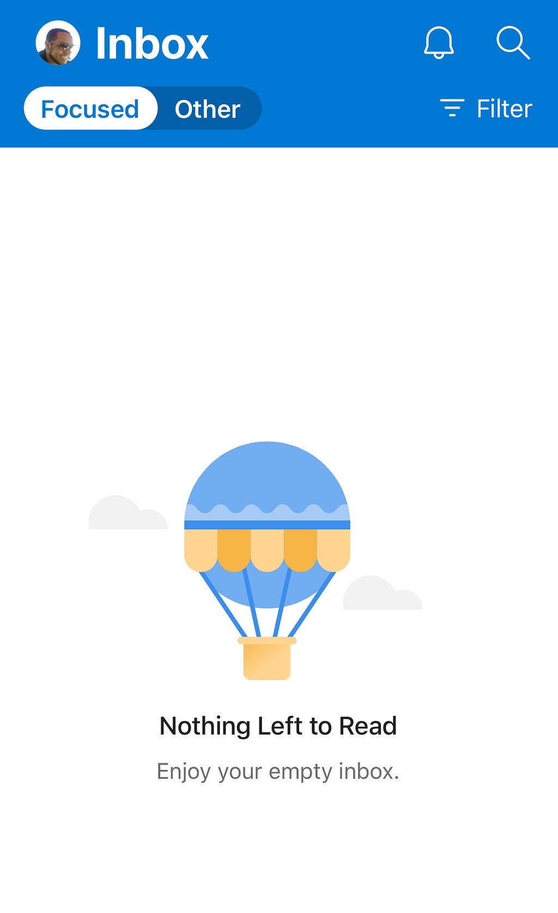
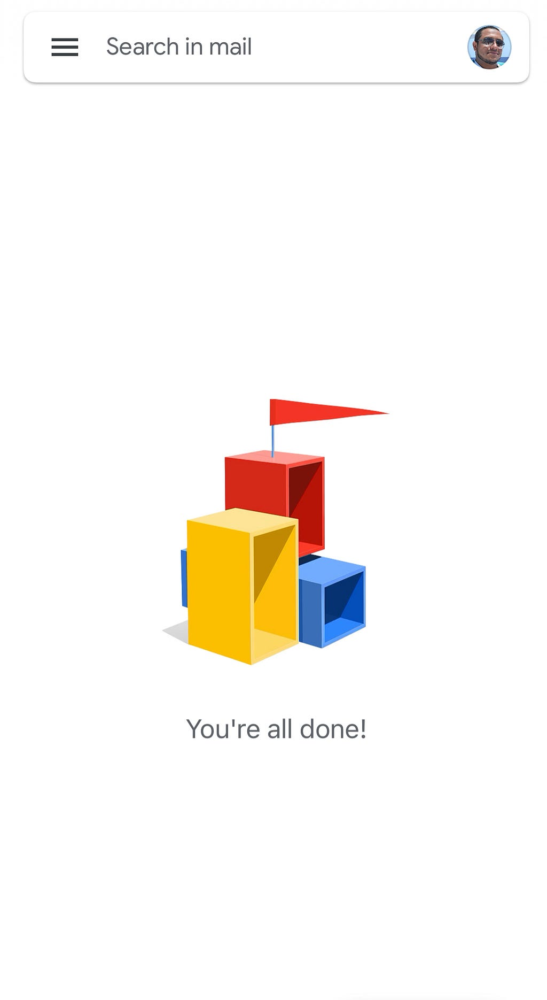
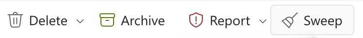
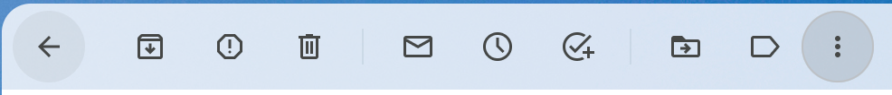
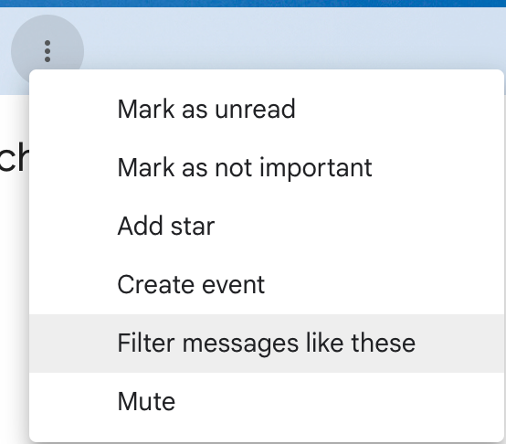
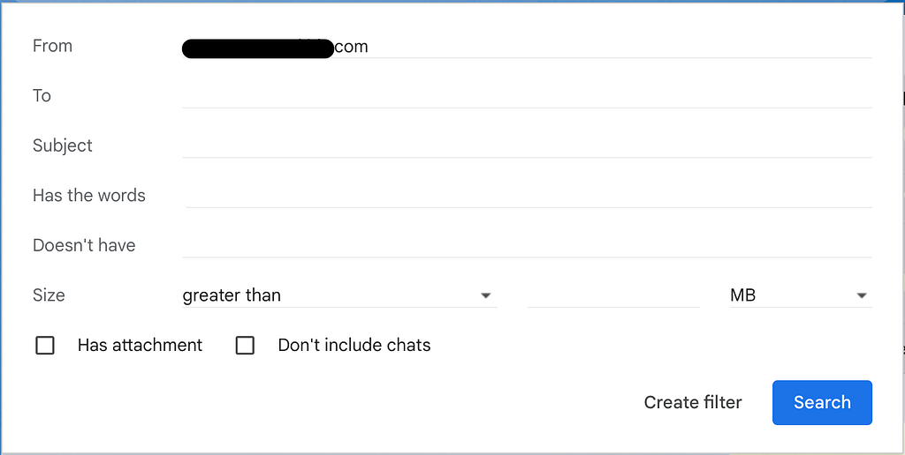
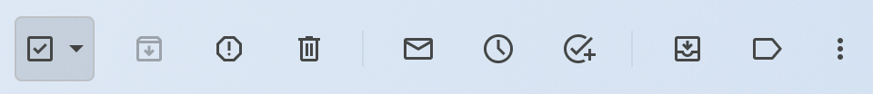
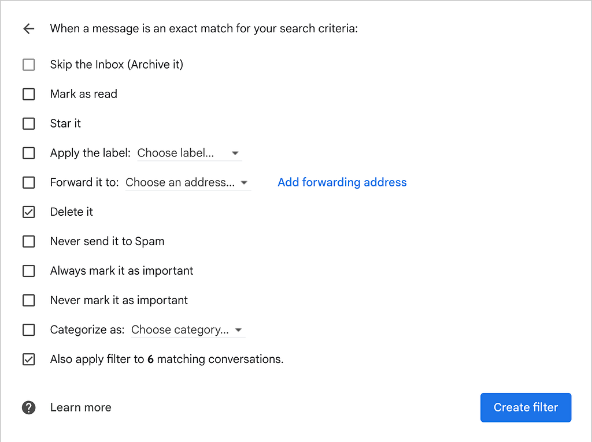
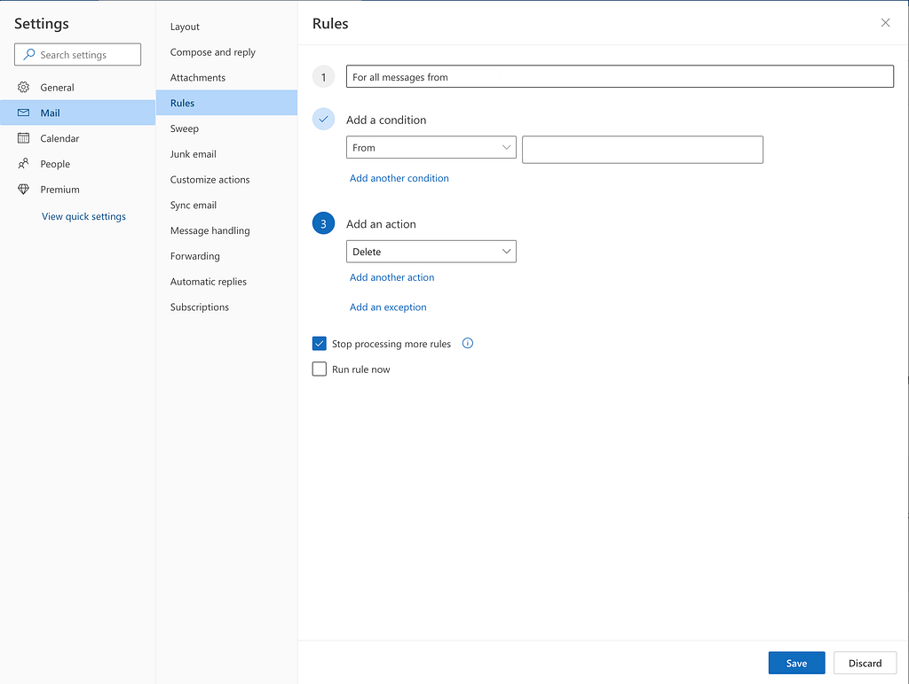

# Enjoy your empty inbox!

#### I managed to keep my everyday inbox empty for over 90 days

I have had my Gmail since I got my invite back in 2004/2005 (Yes, Gmail was by invite only back then), and I have been using it as my primary email since. Only recently, I have also started shifting many of my email communications to my relatively new Outlook inbox.

After reading [Indistractable by Nir Eyal](https://www.nirandfar.com/indistractable/), I decided to clear out the clutter that kept me from focusing on what matters. That includes my email and text message inboxes, phone home screen, and even some physical clutter around my home, but that’s a whole different story. For now, I will focus on how I managed to empty my two most frequently used email inboxes.

*Screenshots of my email apps with empty inboxes*

### What was the clutter all about?

The clutter was mostly coming from store advertisements and newsletter subscriptions, some of which I forgot why I subscribed for in the first place. Sounds familiar? At one point, I discovered messages I had missed or had opened but forgot to act on for a few days as they were hidden in the noise of everything else.

I have meant to clean up that mess for a long time, and I have even had a couple of attempts in the past that failed to get my inbox to the current shape. It wasn’t until I read the Indistractable book that I realized that my messy inbox had more impact on me than the discomfort I feel when I check my email. It also takes away from my time and focus. I then decided to be more aggressive in dealing with the issue of decluttering my inbox and took the time out of my usually busy schedule to empty the most active inboxes I have, and I can assure you it was worth it!

You will be surprised by how quiet and relaxing your email can be and how much storage you can save after this process.

### Unsubscribe and delete

I started with my Outlook inbox since it seemed more achievable as it was the newest inbox, and the clutter there was mainly ads and newsletters. You should use the web version of Outlook for the initial cleanup process. Outlook on the web has that *Sweep* button that makes it much easier to sweep away all the unwanted clutter.

*The Sweep button on Outlook of the web*

I would follow these steps:

1. Select one email from a no-longer welcomed sender
2. Find and click the *unsubscribe* link (usually located next to the sender’s email for your convenience) to unsubscribe
3. Click the cool Sweep button to delete all messages from that sender
4. Confirm … and voilà! All gone.

You will need to repeat the process for many other senders, but you will end up with a significantly lighter inbox after this process.

On **Gmail**, I had to follow a slightly more complicated process for this unsubscribe-and-delete category. I have used the “*Filter messages like these”* feature, also available on the web version of Gmail. The first two steps are the same as before, but for deleting existing messages from the sender, you need to:

1. Make sure you still have one of the sender’s messages open.
2. Click on the three-dot icon at the end of the top menu.
3. Select “*Filter messages like these.*”
4. Review the search criteria and click the “*Search*” button
5. At the top of the search result pages, check the checkbox to select all
6. Hit the delete icon and confirm

> You may see a banner asking whether to select all other messages that match the search criteria. Make sure to select those as well.

*Step 1: Click on the 3-dots*

*Step 2: Select “Filter messages like these”*

*Step 3: Search*

*Step 4: Check the checkbox*

#### What to delete and or unsubscribe from?

Here are some of the emails that fall under the Unsubscribe/Delete category for me (YMMV):

* Store advertisements — *Unsubscribe and delete*
* Newsletters — *Unsubscribe and delete*
* Surveys — *Unsubscribe and delete*
* Disposable receipts, e.g., fast food and coffeeshop receipts — *Delete* (no option to unsubscribe)
* Notifications from providers like Google, Apple, and Facebook about changes to their privacy policy, terms and agreements, and service updates — *Delete* (no option to unsubscribe)
* Previous order confirmations, receipts, and status updates — *Delete only* (You still want to receive future messages)
* Messages with one-time security codes and confirmations of account updates — *Delete only* (You still want to receive future ones)
* Updates from my kids’ schools (What a terrible dad, I know! 🙈). Those are also sent to their stay-at-home mom, who is typically more attentive to them than me anyway — *Unsubscribe or auto-forward and archive if necessary.*

### Rule them out

For some senders, you either don’t want to unsubscribe or you simply can’t. Here are a couple of examples for me:

* There is no *unsubscribe* link, or the link doesn’t seem to work. You get the unsubscribe confirmation, then continue to get the emails.
* Canceling the newsletter subscription would cancel my free tier 😉

For similar situations, I fall back to automatic deletion via rules/filters on both Outlook and Gmail.

The process for **Gmail** is very similar to the previous category, except you select “*Create filter*” on step 4 (instead of *Search)* and then select the “*Delete it”* option. Don’t forget to hit the “*Also apply to matching conversations*” checkbox at the bottom.

*Create a filter to delete all messages from the sender*

For **Outlook**, the rules are defined under Settings — Mail— Rules

*Add Outlook rule to delete all messages from a sender*

### Archive all others

After getting rid of all the useless messages, that leaves the emails that may still be needed in the future but not right now. Mark all the remaining items in the inbox and archive them. They will continue to live in your mailbox behind the scenes, so you can still search for whatever you need from them, but they seize to clutter your inbox.

### Keeping it out

Once you have your relaxing empty inbox, you need to make sure it continues to be so. Here are some of my rules of thumb to keep it clean:

* New ads, newsletters, and surveys that survived the initial cleanup —*Unsubscribe, delete all matching.*
* Disposable receipts or provider notifications that you can’t do anything about anyway — *Delete.*
* One-time used security codes and confirmation messages of account updates — *Delete.*
* Any communication from stubborn senders with a dummy unsubscribe link — *Auto delete (rule them out).*
* Order updates and alike that require no immediate action but may be deemed necessary later — *Archive.*
* Items needed to be accessible for frequent or quick future use, such as hotel reservations and flight tickets — *Star/Save (Move to a Starred/Saved folder) and archive.*
* Updates that someone else can better handle — *Delegate (auto-forward and delete or archive).*
* Messages that require immediate response, or you can reply to or act on right away — *Act, then delete or archive.*
* Messages that can wait and you have no capacity for them now — *Snooze.*
* Messages you should address ASAP, but you are not ready for them just yet— *Keep them in the inbox and maybe mark them unread until ready.*

That last case should be as limited as possible, but even if you fail there, you may end up with less than 2–3 messages in your inbox for no more than a couple of days, which is still tremendous progress over your old inbox. I hope you’ll enjoy your empty inbox!

### Summary

In this story, I have shared how I managed to clear out the two email inboxes I use daily and keep them clear for the last couple of months. It is less stressful and more time efficient to deal only with significant emails. The emails I discarded when I first started are now long gone, as they were automatically deleted from my trash after 30 days, and I can affirm that I did not miss any of them.
