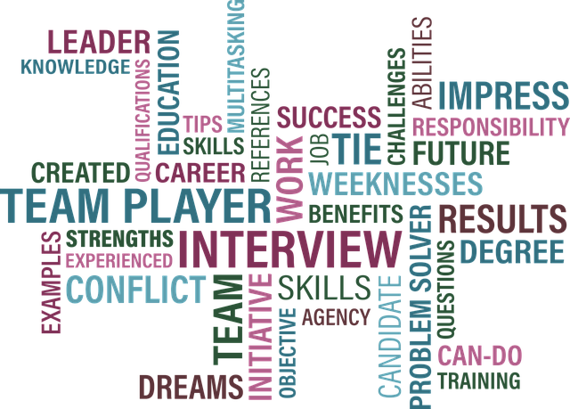

# I recently interviewed with two FAANG companies — Here is my impression

#### Over the last few weeks, I have been interviewing with two of the [FAANG](https://en.wikipedia.org/wiki/Big_Tech) companies, and here is my maybe-biased opinion of both companies based on the whole experience.

Let us call them Company A and Company Z. For company A, I already had an internship with them in the past, so I skipped their online assessment and went directly to one phone screening session, followed by the final round of five virtual onsite interviews. For company Z, although I had onsite interviews with them a couple of years ago, I still had to go through their online assessment, followed by their final round of four virtual onsite interviews.

> Disclaimer: A and Z are “random” letters to represent the two companies, and may or may not have anything to do with the actual company names and or my personal preference of them.

### Company Culture

A question that I like to ask every interviewer is, “*What do you like most about being at Company X?*”. It allows me to learn more about the company culture from different perspectives, and it reflects how an employee feels about being part of that culture. Below is a summary of the answers I got from both companies along with my impression.

For Company A, I could feel the enthusiasm the interviewers have when talking about the company. The answers went like this:

* *“The company cares about your well being.”*
* *“I get to help people around the world.”*
* *“It is a bottom-up company.”*
* *“Always learning something new.”*
* *“Being surrounded by smarter people.”*

For Company Z, I did not feel the same enthusiasm, and the question sounded a little surprising to at least one of them. While some answers may seem very similar, the way it was delivered says a lot. Here are a few examples:

* A boilerplate one from the company guidelines: “*it feels like working at a startup.”*
* One that sounded more like a cliché to me: “*working on something that helps people.”*
* One that sounded genuine was: “*I am allowed to learn and grow*.”

### Work-Life Balance

Based on my experience as a former intern at company A, in addition to the feedback I got from one of the interviewers, it is clear that the company cares about work-life balance, continuously providing the means and encouraging employees to maintain their work-life balance.

For company Z, based on feedback from friends and friends of friends who worked there, it gets quite pushy when it comes to tasks and deadlines. That leaves almost no time for personal life, and one may have to push back to save that right sometimes.

### Recruiter Interaction

Your first, and most of the time last, point of contact is the recruiters, and they can leave quite an impression of the company during and after the interview process. I have been talking with recruiters from both companies over the last few years. It would be unfair to generalize here, as there have been indeed a few exceptions for each case, but I am talking about the general case.

Based on my experience with different recruiters from both companies, I can see how recruiters of company A care about their candidates and are continuously willing to help them succeed by providing all necessary information and continuing to look for possible opportunities.

On the other hand, one can feel how recruiters from company Z are mostly motivated by their targets and hardly care about their candidates. You can see that in posts by some of them on LinkedIn bragging about their *numbers*. A candidate is just one more headcount, and they should minimize the time spent with each candidate by all means.

Here is one example from my most recent experience. After passing my phone screening with company A, the recruiter scheduled a call to go over the next steps with me and what to expect. During the call, he explained clearly everything I needed to know and kept asking whether I had any more questions. For the same call with company Z recruiter, the call was originally scheduled for 30 minutes, but the actual call lasted only 15 minutes. I then heard a reminder in the background for his next call, and he abruptly ended the call encouraging me to reach out by email if I needed any more information.

### What are they looking for anyway?

You get a clear sense of what exactly each company is looking for from preparation material provided by the recruiters and during the interviews.

I would say the most important for company A is your ability to learn and grow, how you communicate, and how you think when solving problems.

Company Z, in my opinion, is a one-man-show company. Hence, the main thing they repeatedly focus on during the interviews is your compliance with the guidelines set by their founder. One can tell that the company trains and provides each interviewer with a set of questions and a checklist used to evaluate your readiness based on that more than anything else, to the point that makes the interview feel more like an interrogation at a certain point.

That is all I have. I intentionally left the names of the two companies out, but if you have ever worked, interviewed, or interacted with someone at either company, you can easily guess the names. That was my *partially-biased* yet mostly objective opinion based on the information I collected during the process. Let me know if you had a similar experience and whether you agree or disagree.
