# Goodbye, garage door remote

#### Control traditional garage door from CarPlay

In [another post](https://medium.com/@amrabed/open-sesame-how-i-automated-my-15-year-old-garage-door-483365c1eb51), I described how I automated my 2006 garage door using [Home Assistant](https://home-assistant.io) to open and close as I enter or leave my home. Here, I am building on top of that to close the loop and use Apple CarPlay to open the garage door to leave my garage and close it after I enter from my car screen. No need for my garage door remote anymore.

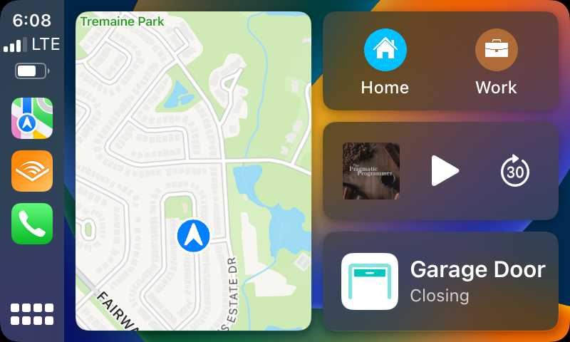
*CarPlay screen with the garage door closing*

As described in the [previous post](https://medium.com/@amrabed/open-sesame-how-i-automated-my-15-year-old-garage-door-483365c1eb51), here is what I used:

* [MyQ Smart Garage Control](https://www.myq.com/products/smart-garage-control)
* [Home Assistant](https://www.home-assistant.io/) installed on a [Raspberry Pi](https://www.raspberrypi.com/products/raspberry-pi-400/)

> You will also need an Apple HomePod, Apple TV (5th+ gen), or an iPad that is always online in your home to act as a home hub for this to work.

#### Add and Configure the HomeKit Integration

Assuming you have already set up Home Assistant and MyQ integration as described [here](https://medium.com/@amrabed/open-sesame-how-i-automated-my-15-year-old-garage-door-483365c1eb51), the next step is to add the [HomeKit integration](https://www.home-assistant.io/integrations/homekit/) to use the Home Assitant server as a HomeKit bridge.

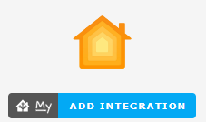
*Add HomeKit Integration*

Similarly, after adding the integration, go to **Settings > Devices & Services > Integrations**, then click the **Configure** button of the HomeKit integration card.

> I would suggest renaming the integration to something like *HomeKit Bridge* or *Home Assistant* instead of the default ugly *HASS* name

Select Bridge for the HomeKit Mode and Include for the Inclusion Mode.

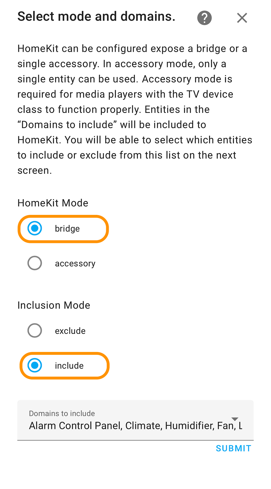
*HomeKit Integration Configuration*

Make sure to select Cover from the Domains to include dropdown list

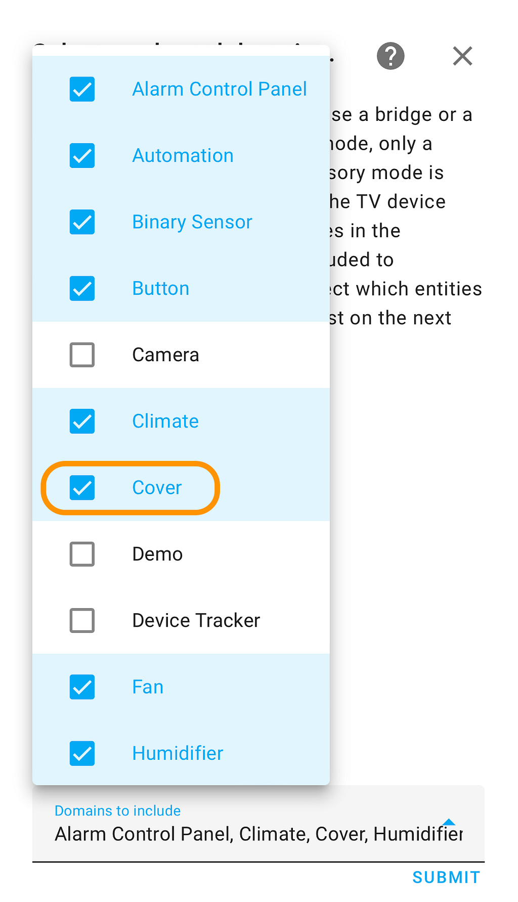

After you submit your selections, you should see a list of devices linked to your Home Assistant server, including your newly added garage door. Select the garage door and any other devices you want to use in the Apple Home App from the list.

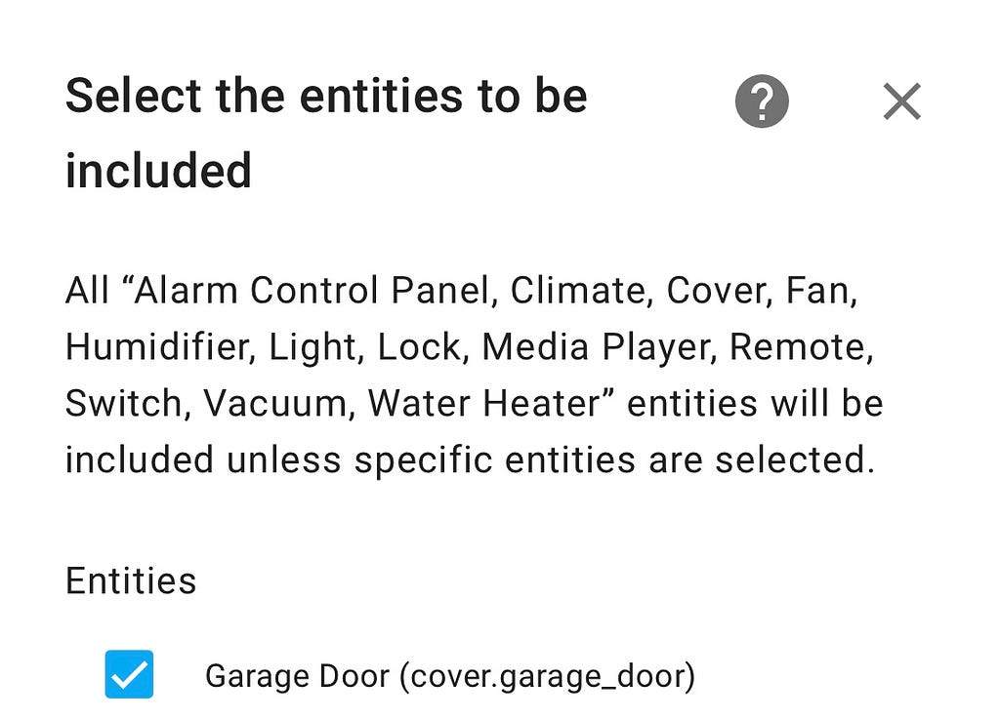
*Select Garage Door to add to your Apple Home App*

Once done, your Home Assistant server acts as a HomeKit bridge.

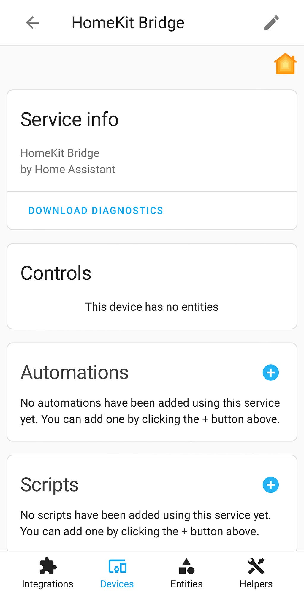

You should also see a new notification with a QR code and an 8-digit code to pair your bridge with your Home App.

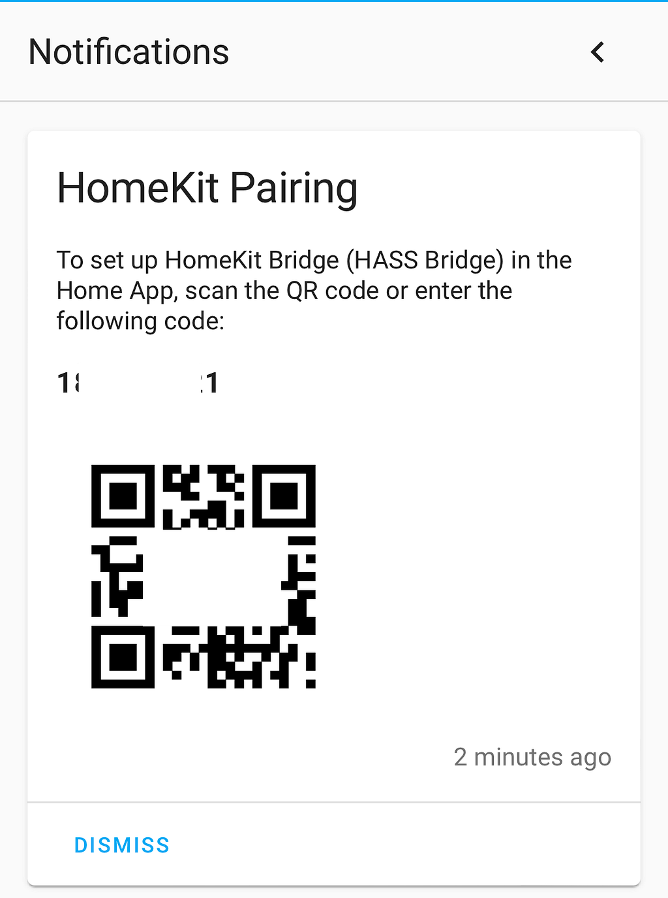
*Notification with QR code and 8-digit code for Home App pairing*

#### Add HomeKit Bridge to the Home App

Now, open the Home App on your Apple device (iPhone, iPad, MacBook,…), click on the + sign on the top right corner of the app, and select Add Accessory and scan the QR code from the Home Assistant integration.

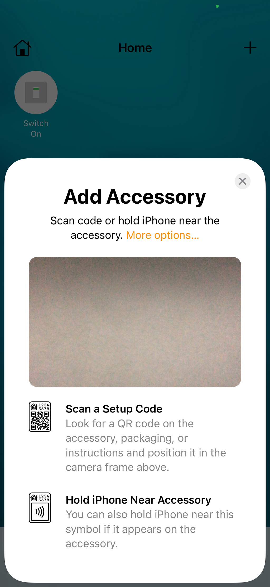

If you are using the Home Assistant app and the Home App on the same device, you can alternatively select the More options... link. You should see the Home Assitant bridge listed. Click that and enter the 8-digit code provided by Home Assistant.

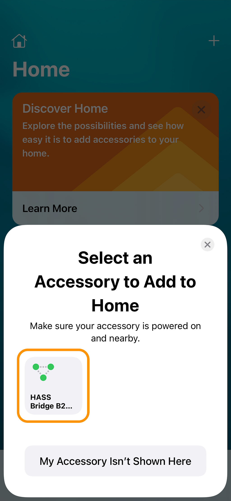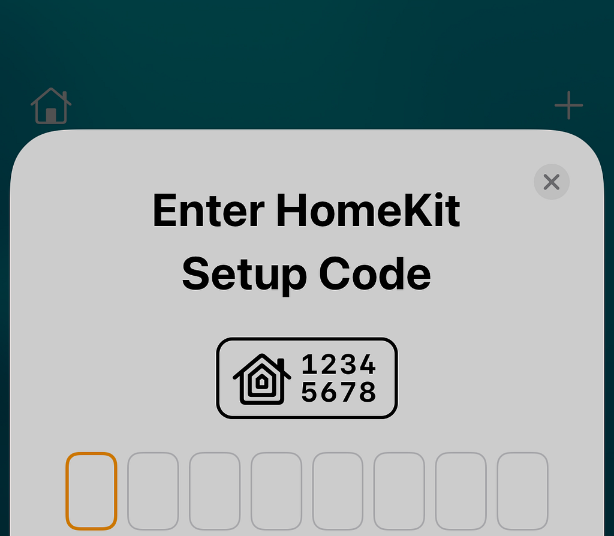

Once you complete the above steps, the app will automatically prompt you to add the devices linked to the Home Assistant server, including your garage door.

> The app will complain about the “uncertified” accessory, which is expected since your Home Assistant server is not certified by Apple. Just tap *Add anyway*

You can now open, close, and check the status of your garage door from the Home App.

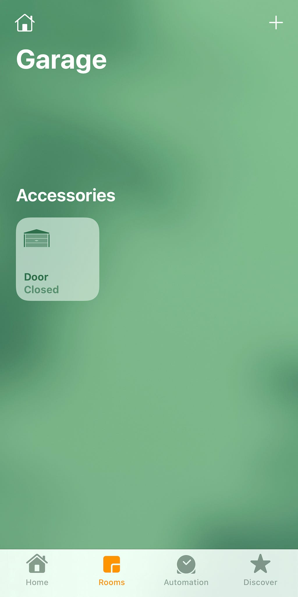
*Garage door added to the Apple Home app*
> Once you add the garage door to your home app, the app will suggest two automation to open and close the garage door on arrival and departure. However, using Apple Home automation for that is not quite practical since it requires your confirmation every time (while driving your car) to run the automation, which makes it unusable. I recommend using Home Assistant for that as described in [this post](https://medium.com/@amrabed/open-sesame-how-i-automated-my-15-year-old-garage-door-483365c1eb51).

After you add your garage door to the Home app, you should see it on your car around your home (as defined in Apple maps) when your phone is connected to CarPlay. Tap and go!
