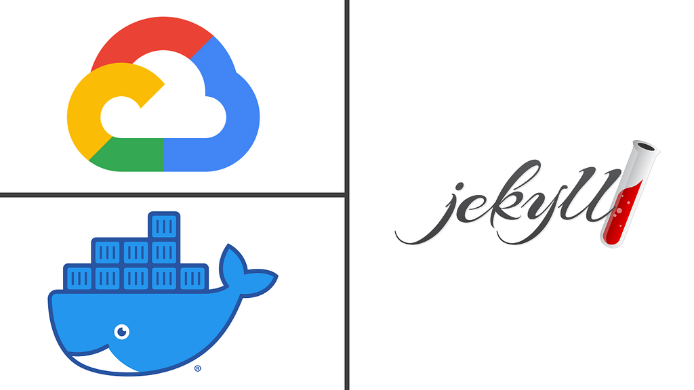

# Using Google Cloud and Docker to Test your Jekyll Website



I am hosting [my website](https://amrabed.com) on [GitHub Pages](https://pages.github.com/), so I am using [Jekyll](https://jekyllrb.com/) to build it. Whenever I update the website code, I need to test it “locally” before pushing/publishing to GitHub.

Typically, I would have Jekyll installed on my local machine or use the [Jekyll Docker image](https://github.com/envygeeks/jekyll-docker). However, I have been running out of space on my Macbook Air quite often recently, so I am trying to avoid any new installations especially if I know I can host in the cloud instead. Below is how you can temporarily host your Jekyll website in a Docker container on Google Cloud for testing purposes.

### Step 0: Set up the environment

If you already have a virtual machine running on Google Cloud with Docker and Docker-Compose installed, you can skip to step 1 below. Otherwise, follow the following instructions.

#### Start a Google Cloud Virtual Machine

Go to the [Google Cloud console](https://console.cloud.google.com/), then go to the [Compute Engine](https://console.cloud.google.com/compute), and start a new virtual machine (VM) of type f1-micro. The F1-micro VM is enough for the purpose and you can keep it running 24/7 on your account for free, as long as you have only one of them.

***Alternatively***, if you already have [Google Cloud CLI](https://cloud.google.com/sdk) installed on your local machine, you can use the following command:

```
gcloud compute instances create server --machine-type f1-micro --tags http-server
```

#### SSH into the Google Cloud VM

To keep it easy, I prefer to use an [SSH config](https://www.ssh.com/ssh/config) file:

```
Host gcloud  Hostname VM_IP_ADDRESS  User USERNAME
```
> Remember to replace ***VM\_IP\_ADDRESS*** with the external IP address for the Google Cloud VM, and ***USERNAME*** with your username on the VM

Now, from the terminal, use this command to SSH into your machine:

```
ssh gcloud
```

#### Install Docker

The simplest way to install [Docker](https://docker.com) is by using this awesome one-liner:

```
wget -qO- https://get.docker.com/ | sh && usermod -aG docker $USER
```

This command downloads an installation script from Docker, runs it to install docker, and then adds the current user to the Docker group.

#### Install Docker Compose (optional)

This is optional but highly recommended. I prefer to use [Docker-compose](https://docs.docker.com/compose) instead of using the docker run command every time. To install docker-compose, use this one-liner:

```
curl -L "https://github.com/docker/compose/releases/download/VERSION/docker-compose-$(uname -s)-$(uname -m)" -o /usr/local/bin/docker-compose && sudo chmod +x /usr/local/bin/docker-compose
```
> Remember to replace ***VERSION*** with the [current version](https://docs.docker.com/compose/install/) of Docker Compose.

### Step 1: Copy the website files to the remote host

To copy the website files from your local machine to the remote host, that is the virtual machine running in Google Cloud, use the following command:

```
scp -r WEBSITE_DIR gcloud:~
```
> Remember to replace ***WEBSITE\_DIR*** with the directory of your website files

### Step 2: Start the Jekyll server

To start the Jekyll server using docker:

```
docker run -d -p 80:4000 -v WEBSITE_DIR:/srv/jekyll jekyll/jekyll jekyll serve
```

That command performs the following operations:

* Starts a container from the official Jekyll Docker image
* Forwards port 4000 (Jekyll port) of the container to port 80 of the host
* Maps the website folder to the /srv/jekyll folder of the container
* Starts the Jekyll server (jekyll serve )

***Alternatively***, instead of writing the same command every time you test your website, use a docker-compose file (docker-compose.yml) like this one:

```
version: '3.3'services:  web:    image: jekyll/jekyll    volumes:      - ./WEBSITE_DIR:/srv/jekyll    ports:      - 80:4000    command: jekyll serve
```

Now, to start the container, use the following command:

```
docker-compose up -d
```

And, to stop it, use:

```
docker-compose down
```

### Step 3: Connect to the Jekyll server locally

To connect to the remote Jekyll server from the browser on your local machine, use [SSH tunneling](https://www.ssh.com/ssh/tunneling):

```
ssh -N -L 8080:localhost:80 gcloud &
```

The -L option forwards connections to port 8080 from the local machine to port 80 of the remote server running on Google Cloud. The -N option tells SSH not to start the shell of the remote host.

Now, from your browser, go to <http://localhost:8080>. You should now see the website up and running on your “local” machine. Enjoy :)

---

[Using Google Cloud and Docker to Test your Jekyll Website](https://medium.com/capsulat/using-google-cloud-and-docker-to-test-your-jekyll-website-3ae5d87a4247) was originally published in [Capsulat](https://medium.com/capsulat) on Medium, where people are continuing the conversation by highlighting and responding to this story.
