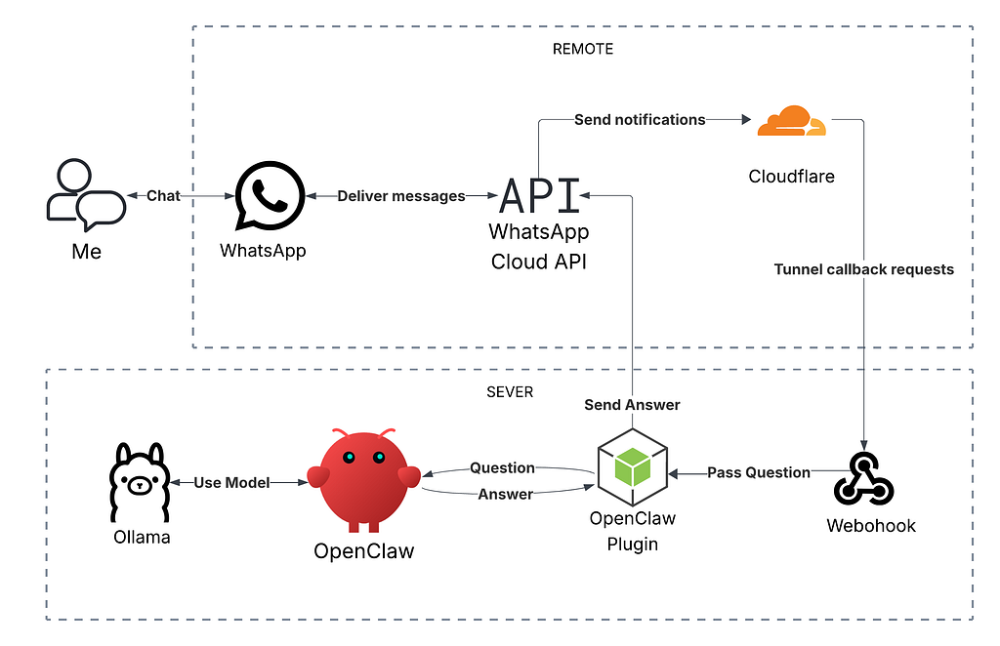
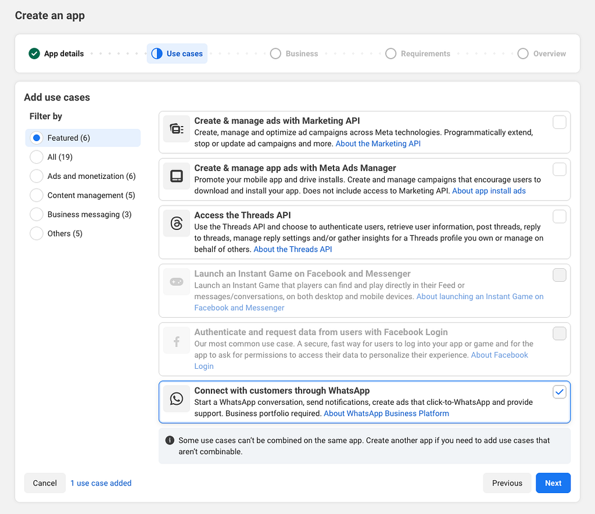

# Self-Host an AI Agent Using OpenClaw and WhatsApp Cloud API (2026)

### **Self-Host an AI Agent Using OpenClaw and** WhatsApp **Cloud API (2026 Guide)**

### *Set up a WhatsApp Business number for your AI agent in under 30 minutes — no third-party providers, no ban risk, using official WhatsApp Cloud API*


*OpenClaw + WhatsApp*

You shouldn’t need to pay a middleman just to put your AI agent on WhatsApp — yet that’s the default everyone ends up recommending. After spending days wading through scattered resources, I finally got OpenClaw talking directly to the WhatsApp Cloud API. Here’s the exact path I took.

In this guide, I am sharing:

* Prerequisites
* How it works
* A Step-by-step Guide
* The resources I used

### Prerequisites

You obviously need [OpenClaw](https://openclaw.ai) for this. To install it on your Linux/Mac server, use the following command:

```
curl -fsSL https://openclaw.ai/install.sh | bash
```

For other installation options, follow the instructions [here](https://docs.openclaw.ai/install).

#### Meta Developer Account

You will need to [register](https://developers.facebook.com/async/registration) as a Meta developer if you are not already.

#### Meta Business Portfolio

You will also need a Meta Business Portfolio. If you don’t have one, you can create it on the [Meta Business Suite⁠](https://business.facebook.com/).

#### Public Domain Name

You will need a public domain for WhatsApp to send callback requests to OpenClaw.

### How It Works

The diagram below shows how the different services communicate with each other while keeping your local server secure.


*Request/Response Flow between OpenClaw and WhatsApp*

Here is how it works:

* You send a message on WhatsApp
* WhatsApp sends a notification to a webhook running on your server through the tunnel
* The webhook passes the message to your plugin to process and pass to the OpenClaw agent
* The agent processes replies to the message and passes the answer back to the plugin
* The plugin then communicates with the WhatsApp Cloud API to send you back your response

### Step-by-step Guide

#### Step 0 (One-Time Setup): Create a WhatsApp Business Account

From the [Business Settings⁠](https://business.facebook.com/latest/settings), create a new WhatsApp account if you don’t have one:

1. Select **WhatsApp accounts** from the sidebar
2. Click the **+ Add** button in the top-right corner and select **Create a WhatsApp Business account**
3. Enter a display name and select a category, e.g., Other. Make sure the display name aligns with the [guidelines](https://www.facebook.com/business/help/757569725593362)
4. Select **Use a display name only** and click **Continue —**WhatsApp will create a virtual number for you
5. Select the new WhatsApp account
6. Select the **Phone Numbers** tab
7. Click the created phone number to open the **Phone Profile**
8. Copy the **ID** and store it in a secure place to use later

#### Step 1: Create a Meta app & Connect WhatsApp Business account

From the [App Dashboard](https://developers.facebook.com/apps), create a new Meta app if you don’t have one:

1. Click on **Create App**
2. Enter the app name and contact email
3. Select **Connect with customers through WhatsApp** use case
4. Select an existing **Meta Business Portfolio** or create one
5. Review details and click **Create app**
6. Select the app from the App Dashboard
7. Expand **App settings** near the bottom of the sidebar and select **Basic**
8. Show and copy the **App secret** and store it in a secure place to use later
9. Select **Use cases** from the sidebar
10. Select **Connect with customers through WhatsApp** and click **Customize**
11. In the **API Setup** section, select the WhatsApp Business Account


*3. Select **Connect with customers through WhatsApp** use case*

#### Step 2: Generate an API Access Token

From the [Business Settings⁠](https://business.facebook.com/latest/settings):

1. Select **System users** from the sidebar
2. Click the **+ Add** button in the top-right corner to create a system user
3. Enter the name for the system user and select a role
4. Select the new system user and click **Assign Assets**
5. From **Apps**, select the app and toggle **Test app**
6. From **WhatsApp accounts**, select the account and toggle **Everything**
7. Click the **Assign assets** button
8. Click the **Generate token** button to generate the API token
9. Add the following permissions to the token: **whatsapp\_business\_messaging** and **whatsapp\_business\_management**
10. Copy the token and store it in a secure place to use later

#### Step 3: Set up a tunnel to your server

I am using CloudFlare for that, but feel free to use whichever setup you prefer. On your server, run:

```
cloudflared tunnel --hostname <your-subdomain> run --url tcp://localhost:3100
```

You can also do the same from the CloudFlare dashboard under **Zero Trust → Networks → Connectors**

Make sure you have the CloudFlareIP list added to the trustedProxies of the OpenClaw gateway. The gateway object of the openclaw.json should look something like this:

```
"gateway": {    "port": 18789,    "mode": "local",    "bind": "loopback",    "controlUi": {      "allowedOrigins": [        "${ALLOWED_ORIGIN}"      ]    },    "auth": {      "mode": "token",      "token": "${OPENCLAW_GATEWAY_TOKEN}"    },    "trustedProxies": [      "173.245.48.0/20",      "103.21.244.0/22",      "103.22.200.0/22",      "103.31.4.0/22",      "141.101.64.0/18",      "108.162.192.0/18",      "190.93.240.0/20",      "188.114.96.0/20",      "197.234.240.0/22",      "198.41.128.0/17",      "162.158.0.0/15",      "104.16.0.0/13",      "104.24.0.0/14",      "172.64.0.0/13",      "131.0.72.0/22"    ],    "tailscale": {      "mode": "off",      "resetOnExit": false    },    "nodes": {      "denyCommands": [        "camera.snap",        "camera.clip",        "screen.record",        "contacts.add",        "calendar.add",        "reminders.add",        "sms.send"      ]    }  }
```

#### Step 4: Install and configure the OpenClaw WhatsApp-Cloud plugin

I am using this unofficial OpenClaw WhatsApp plugin: [openclaw-whatsapp-cloud-api](https://github.com/mcostantino-dev/openclaw-whatsapp-cloud-api). It is a TypeScript app that communicates with the WhatsApp Cloud API. If you prefer, you can actually build your own by following the instructions [here](https://developers.facebook.com/documentation/business-messaging/whatsapp/webhooks/create-webhook-endpoint).

To install the plugin, use these commands:

```
cd ~/.openclawmkdir plugins && cd pluginsgit clone git@github.com:mcostantino-dev/openclaw-whatsapp-cloud-api.gitmv openclaw-channel-whatsapp-cloud openclaw-whatsappcd openclaw-whatsappnpm install && npm run buildopenclaw plugins install -l .
```
> **Note:** the above commands are slightly different from the ones on the repo

Now, let’s configure the plugin using environment variables:

```
cd ~/.openclawnano .env
```

Copy and paste these values into your .env file:

```
# WhatsApp Cloud APIWHATSAPP_PHONE_NUMBER_ID=WHATSAPP_ACCESS_TOKEN=WHATSAPP_APP_SECRET=WHATSAPP_VERIFY_TOKEN=WHATSAPP_WEBHOOK_PATH=/webhook/whatsapp-cloudALLOWED_PHONE=
```

Fill the values in the file with the following:

* **WhatsApp Phone number ID**: the phone number ID from step 0
* **WhatsApp App Secret**: the app secret from step 1
* **WhatsApp Access Token**: the token from step 2
* **WhatsApp Verify Token**: any string you prefer to use as a verify token
* **Allowed Phone**: your phone number

Next, open the openclaw.json file and update the whatsapp-cloudfields so the file looks like that:

```
"channels": {  ... // other channels here, if any  "whatsapp-cloud": {      "enabled": true,      "phoneNumberId": "${WHATSAPP_PHONE_NUMBER_ID}",      "accessToken": "${WHATSAPP_ACCESS_TOKEN}",      "appSecret": "${WHATSAPP_APP_SECRET}",      "verifyToken": "${WHATSAPP_VERIFY_TOKEN}",      "webhookPath": "${WHATSAPP_WEBHOOK_PATH}",      "webhookPort": 3100,      "dmPolicy": "allowlist",      "allowFrom": [        "${ALLOWED_PHONE}"      ]   }},  ... // other objects here, e.g., gateway, skills, etc."plugins": {   "load": {      "paths": [        "~/.openclaw/plugins/whatsapp-cloud"      ]    },    "entries": {      ... // other plugins here      "openclaw-whatsapp-cloud-api": {        "enabled": true      }    }  }
```

Finally, restart the OpenClaw gateway

```
openclaw gateway restart
```

You should now have a webhook listening on port 3100 for WhatsApp Cloud API callback requests

#### Step 5: Configure the webhook

From the [App Dashboard](https://developers.facebook.com/apps):

1. Select the app
2. Select **Use cases** from the sidebar
3. Select **Connect with customers through WhatsApp** and click **Customize**
4. Select **Configuration**
5. For the **Callback URL**, enter https://<your-subdomain>/webhook/whatsapp-cloud
6. For the **Verify token**, enter the verify token you chose in step 4
7. The API verifies your webhook, then shows a list of webhook fields
8. Under **Webhook fields**, enable **messages**

#### **Step 6: Test the connection**

Open WhatsApp on your phone, **search** for the WhatsApp business phone number, and start chatting. Your OpenClaw agent should respond to you. Enjoy!

### **Troubleshooting**

#### OpenClaw gateway failing to start

Make sure openclaw.json has no issues. Run the following command to check:

```
journalctl --user -u openclaw-gateway.service -f
```

It should give you a list of issues in the file.

#### Tunnel not connecting

Make sure the webhook is listening on your server on port 3100 using this command:

```
netstat -tap tcp | grep 3100
```

You should get something like:

```
tcp6  0  0 [::]:3100  [::]:*   LISTEN   123456/openclaw-gat
```

#### Webhook verification failure

Make sure your callback URL is reachable from the internet. Try running this command on your local:

```
curl "https://<your-subdomain>/webhook/whatsapp-cloud?hub.mode=subscribe&hub.challenge=123&hub.verify_token=<verify-token>"
```

Remember to replace <your-subdomain> and <verify-token>with your values. You should get 123 back

### References

* [OpenClaw documentation](https://docs.openclaw.ai)
* [WhatsApp Cloud API Get Started](https://developers.facebook.com/documentation/business-messaging/whatsapp/get-started)
* [WhatsApp Business Accounts documentation](https://developers.facebook.com/documentation/business-messaging/whatsapp/whatsapp-business-accounts)
* [CloudFlare Tunnel Documentation](https://developers.cloudflare.com/cloudflare-one/networks/connectors/cloudflare-tunnel/)
* OpenClaw WhatsApp Plugin (unofficial): [mcostantino-dev/openclaw-whatsapp-cloud-api](https://github.com/mcostantino-dev/openclaw-whatsapp-cloud-api)

You should now have a fully functioning WhatsApp number for your OpenClaw agent, running securely through your own tunnel without third-party fees. What kind of AI agent are you building with OpenClaw? Let me know in the comments below! If you run into any issues during setup, drop a question, and I’ll help you troubleshoot.

---

[Self-Host an AI Agent Using OpenClaw and WhatsApp Cloud API (2026)](https://medium.com/capsulat/self-host-openclaw-ai-agent-whatsapp-cloud-api-5a4c29bca247) was originally published in [Capsulat](https://medium.com/capsulat) on Medium, where people are continuing the conversation by highlighting and responding to this story.
