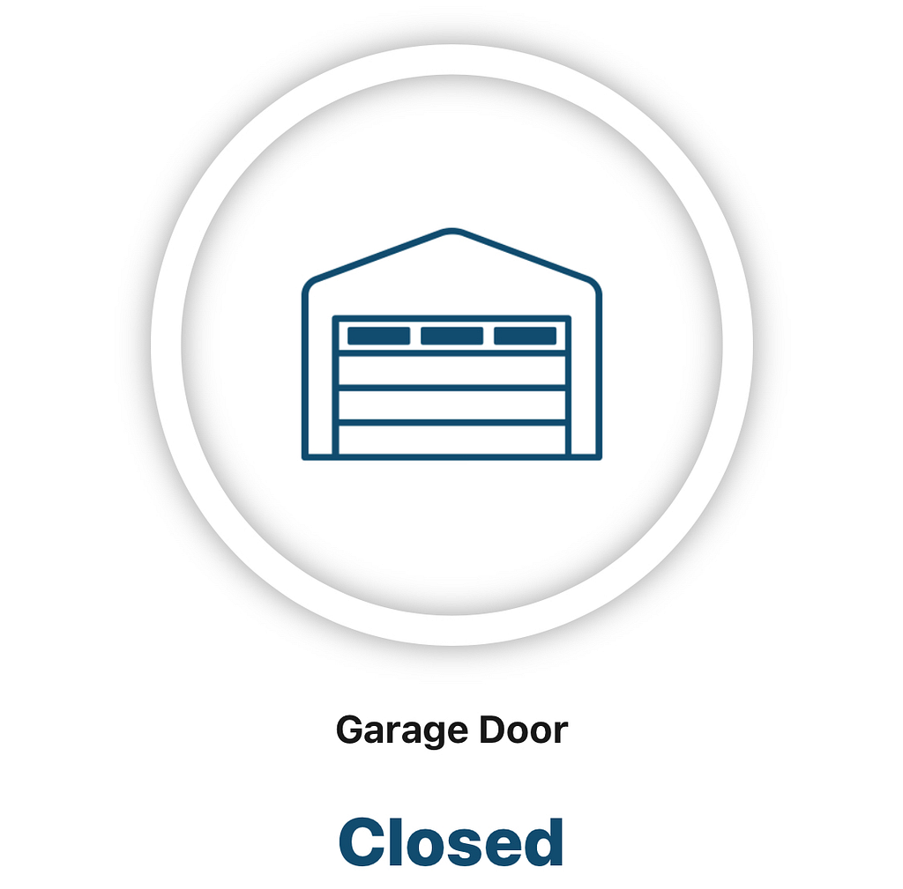
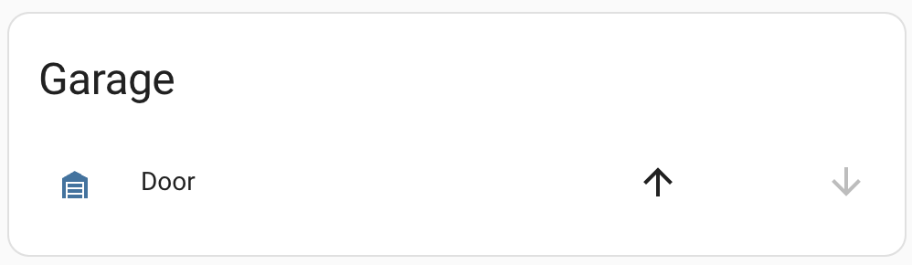
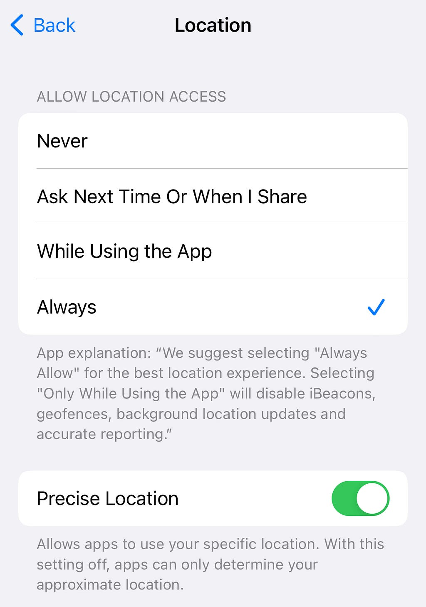
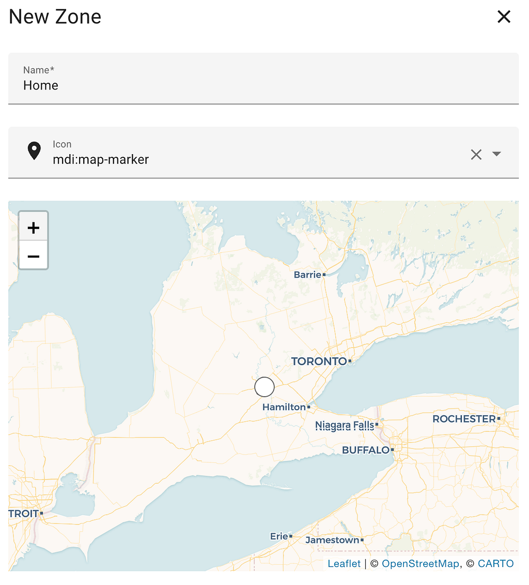
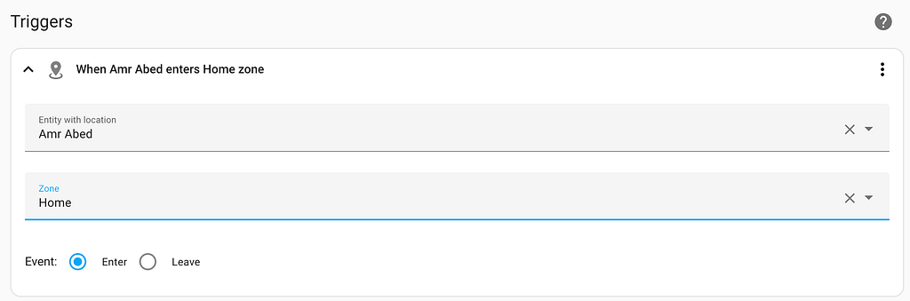
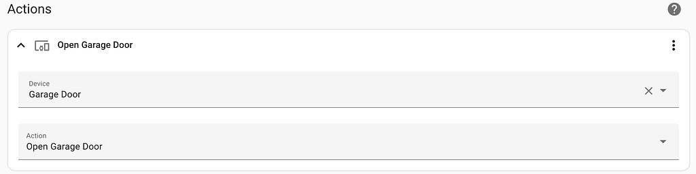
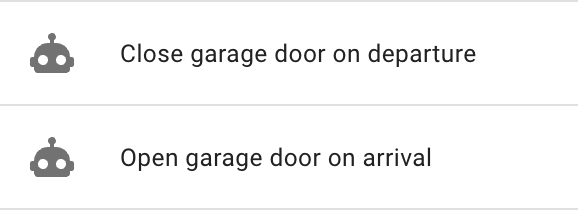

# Open, Sesame! How I automated my 15-year-old garage door

#### Automate your traditional garage door using Home Assistant

I recently moved into a house with an attached garage, for which the owner handed me a bulky remote control for the garage door. Every time I arrived or left home, I reached for the remote and made sure to be close enough to the door to open or close it. After a couple of months of doing that and parking outside my garage most of the time, I knew there must be a better way.

I decided to use [Home Assistant](https://www.home-assistant.io) to automatically open and close the garage door on arrival and departure, and here is how I did it with minimal cost.

**Here is what I used**

* [MyQ Smart Garage Control](https://www.myq.com/products/smart-garage-control)
* [Home Assistant](https://www.home-assistant.io/) installed on a [Raspberry Pi](https://www.raspberrypi.com/products/raspberry-pi-400/)

#### Set up the Smart Garage Hub

I chose the [MyQ Smart Garage Hub](https://www.myq.com/products/smart-garage-control) because it is well-reviewed, so easy to install, and one of the cheapest options (I got it for ~$20 on a Prime day). No regrets so far.

Install the [MyQ app](https://www.myq.com/app) and follow the easy instructions in the app to set up your hub if you haven’t done so already.

> **Important:** Make sure to register using a username and password not a social media account. You will need those credentails later.

You can now open and close your garage door using the app on your mobile device.

#### Set up Home Assistant

Suppose you are already using Home Assistant, then good for you. You can skip this step.

If you are not using Home Assitant, you are missing out on a world of home and life automation integrations. Get a [Raspberry Pi](https://www.raspberrypi.com/products/raspberry-pi-400/) if you don’t have one already, and follow the instructions [here](https://www.home-assistant.io/installation/raspberrypi) to install Home Assistant.

> Alternatively, you can install Home Assistant on your computer as described [here](https://www.home-assistant.io/installation/). The Raspberry Pi installation is the most recommended way for best performance especilly if you plan to use Home Assistnat to cotrol other devices (I know you will)

Once you complete the instructions, you now have a Home Assistant server running locally on the home network that you can use to control almost all smart home devices in your home. The server address is <http://homeassistant.local:8123> by default. You can access it from any browser on any device or using the [Home Assistant app](https://companion.home-assistant.io/).

*Home Assistant*

#### Add and Configure the MyQ Integration

You will need to add the [MyQ Integration](https://www.home-assistant.io/integrations/myq) to your Home Assistant server by simply clicking [this link](https://my.home-assistant.io/redirect/config_flow_start?domain=myq) or by clicking the ADD INTEGRATION button on the [MyQ Integration page](https://www.home-assistant.io/integrations/myq).

*Add MyQ Integration*
> Alternatively, you can also follow the [Manual configuration steps](https://www.home-assistant.io/integrations/myq/#configuration)on the same page.

After the integration is added, go to **Settings > Devices & Services > Integrations**, and click the **Configure** button of the MyQ integration card. That would require the credentials of your MyQ account. Once you log in using your credentials, your garage door will appear as a device.

*Garage door on Home Assistant*

At this point, you can manually open and close your garage door using Home Assistant.

#### Enable remote access

> It is **critical** to complete the [securing checklist](https://www.home-assistant.io/docs/configuration/securing/) before enabling remote access to your home assistant. You are exposing your home devices to the Internet!!

Follow the instructions [here](https://www.home-assistant.io/docs/configuration/remote) to enable remote access to your Home Assistant server. This is required to control your home devices outside your home network. Here is a summary of the simplest way to get that done:

* Register a domain for your home on [Duck DNS](https://duckdns.org)
* Set up SSL on your Home Assistant using [dehydrated](https://github.com/dehydrated-io/dehydrated)
* Restart home assistant
* Enable port forwarding on your home router

You should now be able to open and close your garage door using the Home Assistant app from outside your home network. You can test that by turning off WiFi on your mobile device and connecting to Home Assitant using the home domain you set up, e.g., http**s**://myhome.duckdns.org:8123, then try to open and close your garage door.

#### Give the mobile app access to your device location

You will need to have the [Home Assistant mobile app](https://companion.home-assistant.io/) installed and permit it to use your ***precise*** location ***always***. The location of your mobile device is used to determine when you arrive or leave home.

*Location permissions on iPhone*

#### Define your home zone

Next, define your ***Home*** [zone](https://www.home-assistant.io/integrations/zone/) on Home Assistant. Make sure to zoom in enough to set your home zone accurately.

*Home zone*

#### Set up automation

Finally, log in to Home Assistant, and go to **Settings > Automations & Scenes**. Click the + CREATE AUTOMATION button, and select Start with an empty automation. You will need to repeat the following steps twice, one for arrival and one for departure.

**Triggers:** Click + ADD TIGGER and select Zone

* ***Entity with location***: Select your person or device entity
* ***Zone***: Home (defined in the last step)
* ***Event***: Enter (arrival) or Leave (departure)

*Automation trigger*

**Actions**: Click + ADD ACTION and select Device

* ***Device***: Garage door
* ***Action***: Open garage door (arrival) or Close garage door (departure)

*Automation action*

Save your automation and give it a name.

*Home Assistant automations*

You’re all set. Enjoy!

#### Bonus — Close the loop!

So far, your garage door will open and close for you on arrival and departure, but you still need to use the bulky remote to open or close the garage door from the inside before you leave and after you enter the garage. See [this post](https://medium.com/@amrabed/goodbye-garage-door-remote-50081b605329) to close the loop and get rid of that remote from the year 2000.
